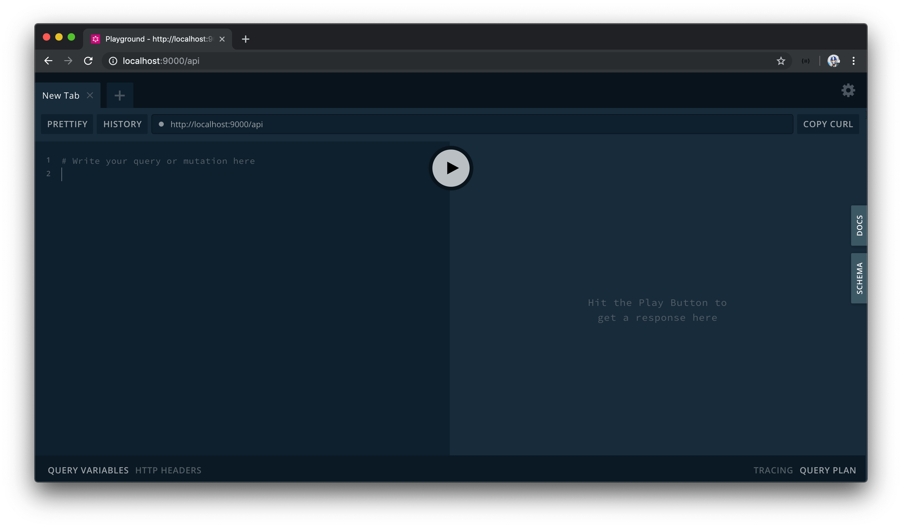
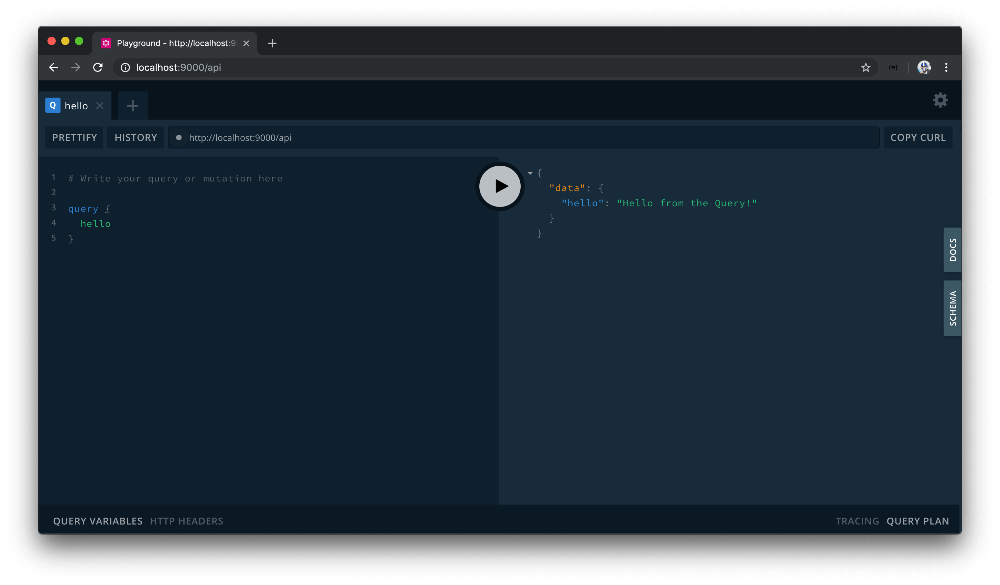
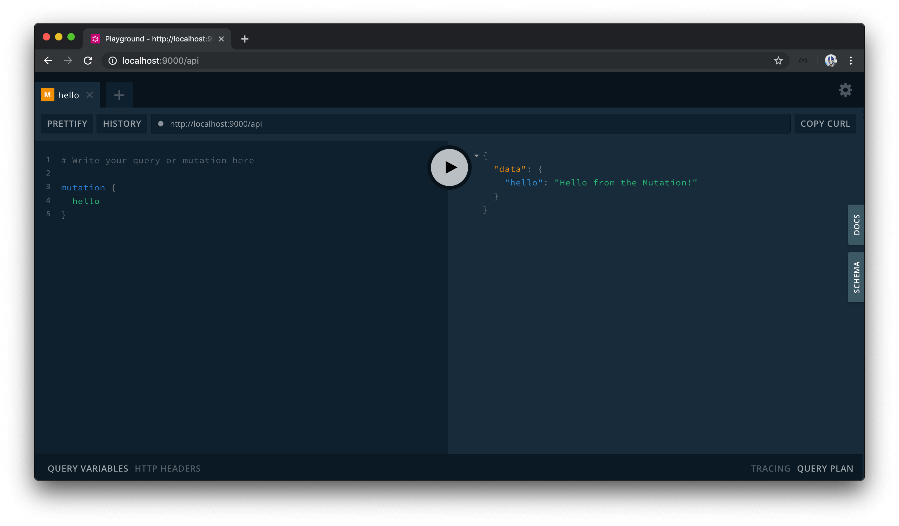
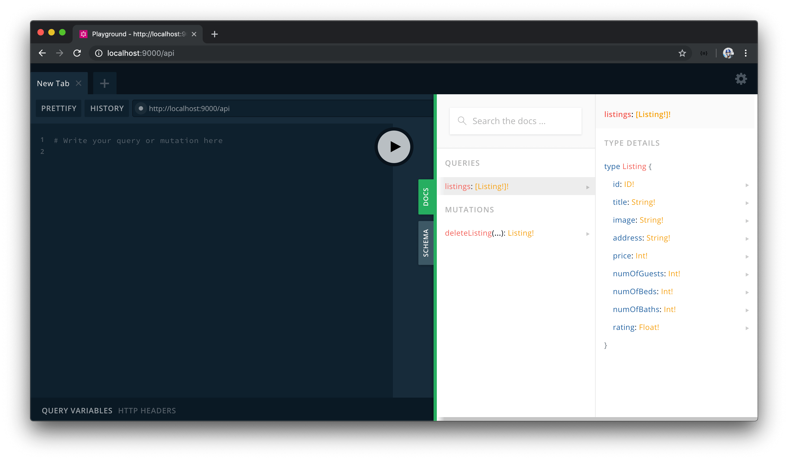
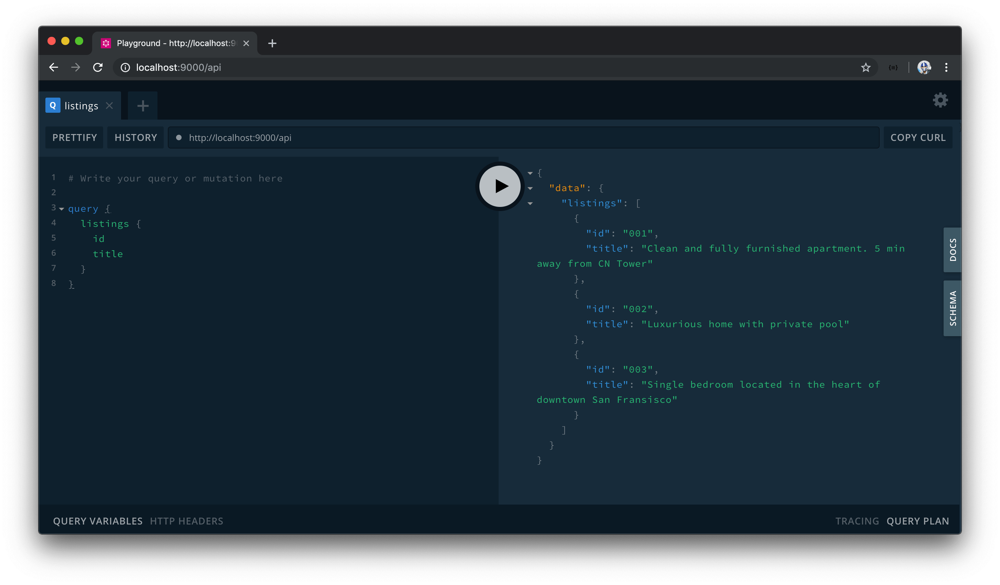
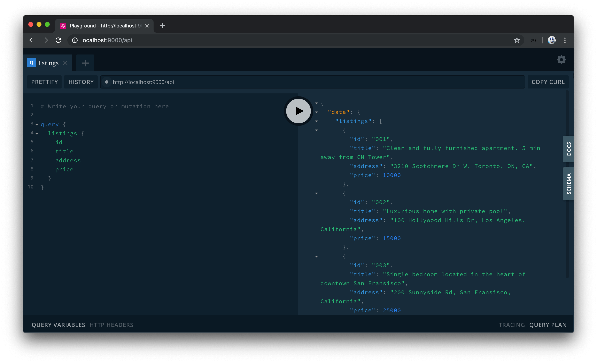
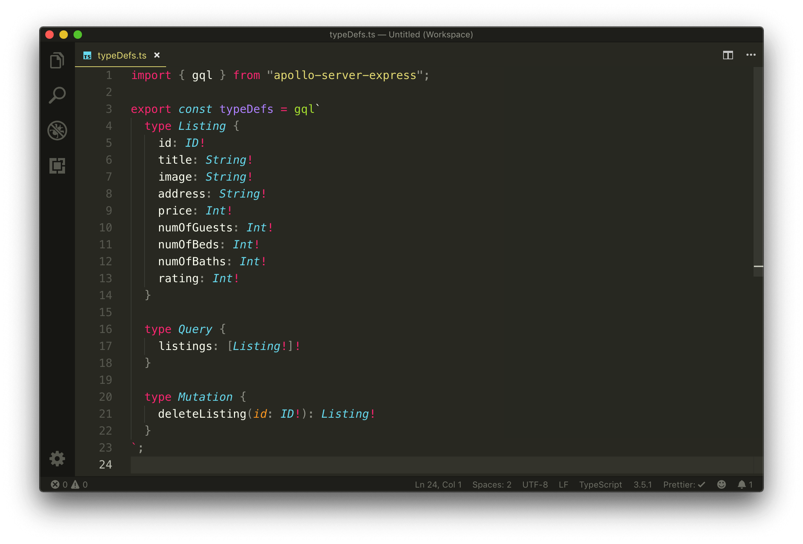

# GraphQL + Apollo Server + Node.js初使用

We have an understanding of how GraphQL is a typed query language that allows client-side applications to request the data they want. With that said, how would one go about creating a GraphQL API?

如何在Nodejs的环境下创建GraphQL API？

**GraphQL is a specification, not a direct implementation**. This means GraphQL can be implemented in multiple programming languages. In our case, we'll be using [Apollo](https://www.apollographql.com/) to create our API.

**GraphQL只是一个规范，而不是某种具体实现**，我们将使用Apollo 创建我的API服务。

In particular, we'll be using the [Apollo Server](https://www.apollographql.com/docs/apollo-server/) package, which is the server package within the Apollo ecosystem. Apollo Server allows us to create a production-ready, self-documenting, GraphQL API in Node applications. It's really easy to get started with and incrementally adoptable.

In this module, we'll:

- Install Apollo Server and the GraphQL JavaScript library.
- Create a GraphQL Schema.
- Build GraphQL resolver functions to interact with our mock data.
- Finally, recreate our schema with the much simpler GraphQL Schema Language.

> GraphQL Schema 可以理解成一个蓝图，里面具体规划了你的API如何实现。

## Installing Apollo Server and GraphQL

We've mentioned that the GraphQL specification _isn't_ tied to any specific technology. We've also talked about one of the popular suite of tools in the GraphQL ecosystem, [Apollo](https://www.apollographql.com/).

[Apollo Server](https://www.apollographql.com/docs/apollo-server/) is one of the libraries within the Apollo framework and its responsibility is to help build a GraphQL API within Node applications. Apollo Server enables us to connect a GraphQL schema to a server and can be used to spin up a stand-alone server, be an add-on to an existing Node server, or even work within "serverless" environments. We'll go with the approach of adding Apollo Server to our existing Node/Express server.

### apollo-server-express

To add Apollo Server to an existing Node/Express server project, we'll install the `apollo-server-express` library.

```shell
npm install apollo-server-express
```

[`apollo-server-express`](https://github.com/apollographql/apollo-server/tree/master/packages/apollo-server-express) is a TypeScript project so we won't have to install an additional type declaration file for it.

> 看来TS体系越来越完善了，最近的项目都支援TS了！pass:这个课使用TS构建的，因此这里需要保证项目中用到的第三方库.d.ts的完善。

### graphql

To use Apollo Server, we'll need to install another dependency into our app. We'll need to install the [`graphql`](https://github.com/graphql/graphql-js) JavaScript library. This is because the `graphql` library is a peer dependency of the Apollo Server package. In addition, the `graphql` library will also be used in our first attempt to build our schema.

We'll install the `graphql` library as an application dependency.

```shell
npm install graphql
```

The `graphql` library doesn't have its own type definitions, so we'll need to install the corresponding type declaration file (`@types/graphql`).

```shell
npm install -D @types/graphql
```

These are the only additional libraries we'll need to begin developing our GraphQL Schema!

## Creating a GraphQL Schema with the GraphQL JS Library

### Gameplan 

> 我理解的就是要使用 `Apollo` 的准备工作...

Let's quickly summarize how we want to introduce Apollo Server before we begin doing so.

To introduce Apollo server to our application, the first thing we'll need to do is create an instance of Apollo server. This is done by importing the `ApolloServer` class and constructing a new instance with the `ApolloServer` constructor.

```typescript
import { ApolloServer } from "apollo-server-express";

const server = new ApolloServer();
```

With an Apollo Server instance created, the `apollo-server-express` library allows us to specify middleware that works alongside the existing server middleware. It's in this middleware where we can pass in the express `app` instance as well as specify the endpoint for where our GraphQL API should live.

```typescript
import { ApolloServer } from "apollo-server-express";

const app = express();
const server = new ApolloServer();

server.applyMiddleware({ app, path: "/api" });
```

The `ApolloServer()` constructor can take in a series of _options_ needed to instantiate the Apollo Server instance. The conventional options that can often be passed in are the:

- `typeDefs`: String that represents the entire GraphQL schema.
- `resolvers`: Map of functions that implement the schema.

Though we're going to aim to get to this point, we'll begin by going through a more "bare-bones" approach to creating a GraphQL server. In the first attempt to creating our schema, we'll import and create [GraphQLObjectType](https://graphql.org/graphql-js/type/#graphqlobjecttype)'s with the help of the `graphql` JavaScript library.

> 这里并没有用gql模板语法，而是使用了 `bare-bones` 这种方式进行编写代码，我真的不知道该怎么翻译这个 bare-bones ... 但可以理解为gql编译后的语法？

### Simple GraphQL Schema

To begin, we'll have the `ApolloServer` constructor class imported in our `/src/index.ts` file. We'll run the constructor function and assign the result to a `server` const variable. We won't pass in any arguments to the constructor just yet. We'll apply middleware to the Apollo Server instance and pass in the `express` app instance, and state our GraphQL API will be on a path of `/api`.

Finally, we'll also remove all the RESTful Express Routes we've created since we'll now be moving towards GraphQL. We'll remove the import of `listings` as well as remove the import and use of `bodyParser`.

At this moment, our `src/index.ts` file will look like the following:

```typescript
import express from "express";
import { ApolloServer } from "apollo-server-express";

const app = express();
const port = 9000;
const server = new ApolloServer();

server.applyMiddleware({ app, path: "/api" });
app.listen(port);

console.log(`[app] : http://localhost:${port}`);
```

Let's now look to create a schema with the `graphql` JavaScript library. We'll build our schema within a new file called `graphql.ts` that is to be created in our `src/` folder.

```shell
server/
  // ...
  src/
    graphql.ts
    index.ts
    listings.ts
  // ...
```

To create our schema, we'll be using class objects that the `graphql` JavaScript library provides. We're going to begin by importing two classes from the graphql library [GraphQLSchema](https://graphql.org/graphql-js/type/#graphqlschema) and [GraphQLObjectType](https://graphql.org/graphql-js/type/#graphqlobjecttype).

```typescript
import { GraphQLSchema, GraphQLObjectType } from "graphql";
```

- [`GraphQLSchema`](https://graphql.org/graphql-js/type/#graphqlschema) is to be used to create a GraphQL Schema by passing in the root level query and mutation GraphQL object types.
- [`GraphQLObjectType`](https://graphql.org/graphql-js/type/#graphqlobjecttype) is the most basic component of a GraphQL schema which can be used to represent practically all our GraphQL object types from the root query and mutation types to specific custom types.

To get us started, we'll construct a blank query and mutation object types with the help of the `GraphQLObjectType` class. Though the `GraphQLObjectType` constructor can take a series of options, we'll only specify the `name` option for each object type and name them accordingly as `'Query'` and `'Mutation'`.

```typescript
import { GraphQLSchema, GraphQLObjectType } from "graphql";

const query = new GraphQLObjectType({
  name: "Query"
});

const mutation = new GraphQLObjectType({
  name: "Mutation"
});
```

We'll then pass the constructed `query` and `mutation` objects as options to a `GraphQLSchema` constructor. We'll also export this created schema.

```typescript
import { GraphQLSchema, GraphQLObjectType } from "graphql";

const query = new GraphQLObjectType({
  name: "Query"
});

const mutation = new GraphQLObjectType({
  name: "Mutation"
});

export const schema = new GraphQLSchema({
  query,
  mutation
});
```

At this point, TypeScript will display some errors in our `GraphQLObjectType` constructors telling us that the `fields` of the object type is required. This is valid since the GraphQL query language is all about selecting fields on objects.

We'll go ahead and declare the `fields` option for each object type. The `fields` option expects us to specify a map of the different fields that live within the object type. In both cases, we'll declare a simple `hello` field to get us started.

```typescript
import { GraphQLSchema, GraphQLObjectType } from "graphql";

const query = new GraphQLObjectType({
  name: "Query",
  fields: {
    hello: {}
  }
});

const mutation = new GraphQLObjectType({
  name: "Mutation",
  fields: {
    hello: {}
  }
});

export const schema = new GraphQLSchema({
  query,
  mutation
});
```

A field property also takes options of its own. Here we can specify the `type` option to dictate the type of the field, and a `resolve` function to dictate how the field is expected to _resolve_.

`type` could be a Scalar type, Object type, Enum type, etc. In this case, we'll want to specify that the return type of our `hello` field is a string so we'll import the `GraphQLString` scalar type and specify that as the type of our `hello` fields.

```typescript
import { GraphQLSchema, GraphQLString, GraphQLObjectType } from "graphql";

const query = new GraphQLObjectType({
  name: "Query",
  fields: {
    hello: {
      type: GraphQLString
    }
  }
});

const mutation = new GraphQLObjectType({
  name: "Mutation",
  fields: {
    hello: {
      type: GraphQLString
    }
  }
});

export const schema = new GraphQLSchema({
  query,
  mutation
});
```

Every field in a schema should have a resolver function that resolves the value of that GraphQL field. Here, we're able to use the `resolve` function option to do so. For both hello fields, we'll resolve to return simple string messages - `'Hello from the Query!'` for the query and `'Hello from the Mutation!'` for the mutation.

```typescript
import { GraphQLSchema, GraphQLObjectType, GraphQLString } from "graphql";

const query = new GraphQLObjectType({
  name: "Query",
  fields: {
    hello: {
      type: GraphQLString,
      resolve: () => "Hello from the Query!"
    }
  }
});

const mutation = new GraphQLObjectType({
  name: "Mutation",
  fields: {
    hello: {
      type: GraphQLString,
      resolve: () => "Hello from the Mutation!"
    }
  }
});

export const schema = new GraphQLSchema({ query, mutation });
```

With our barebones schema created, we can now have it imported and passed into the `ApolloServer` constructor in the `/src/index.ts` file.

```typescript
const server = new ApolloServer({ schema });
```

When we now run the server and head to the location of our GraphQL Endpoint - <https://localhost:9000/api>, we'll be presented with an IDE to interact with our API!



### GraphQL Playground

> GraphQL 的IDE，可以方便的调试API接口

[GraphQL Playground](https://github.com/prisma/graphql-playground) is an in-browser IDE (Integrated Development Environment) for exploring GraphQL APIs. GraphQL Playground is built by the Prisma team and is based on another IDE called [GraphiQL](https://github.com/graphql/graphiql) (which is what we used for interacting with Github's public GraphQL API).

GraphQL Playground is intended to be a more sophisticated IDE by giving us capabilities such as looking through query history, automatic schema reloading, the configuration of HTTP headers, and so on. The vast majority of the time, however, we'll often find ourselves interacting with our API by surveying the documentation of our GraphQL schema and running queries/mutations to verify our API works as intended without having to use `curl` or tools like Postman.

On the left-hand pane, let's look to write our first query. We'll use the `query` keyword and declare the `hello` field as the field we'll want to query. When successful, we'll get the data we expect!



This will behave similarly for the mutation as well. We'll use the `mutation` keyword and state the `hello` field as the `mutation` we'll want to run.



Amazing. Our Express app is now prepared with Apollo Server. In the next lesson, we'll look to replicate the functionality we had in our Express REST API (querying listings and deleting a listing) with our GraphQL setting.

## Querying and mutating listings data with GraphQL

- scalar types的一个使用
- 介绍如何使用Query 以及mutation 进行CRUD
- 在IDE中跑该demo

We've created a simple GraphQL Schema with which our root level query and mutation object types each have a single `hello` field that returns a string message when queried. We'll now look to mimic the listings retrieval and manipulation we had in our REST API with GraphQL.

### Listing Object Type

The first thing we'll do is create a custom `Listing` object type. The `Listing` object type is to reference the listing type that is to be returned from our soon to be query and mutation. We'll use the `GraphQLObjectType` class to construct this type in the `src/graphql.ts` file.

The `Listing` type is to contain a series of fields that represent a listing.

```typescript
const Listing = new GraphQLObjectType({
  name: "Listing",
  fields: () => ({
    id: {},
    title: {},
    image: {},
    address: {},
    price: {},
    numOfGuests: {},
    numOfBeds: {},
    numOfBaths: {},
    rating: {}
  })
});
```

We'll need to define the types of each of the fields within `Listing`.

### `GraphQLID`

GraphQL provides a unique scalar type for ID's, [`GraphQLID`](https://graphql.org/graphql-js/type/#graphqlid). The `GraphQLID` scalar type is to represent a unique identifier however it behaves and gets serialized as a `String`. Its main purpose is to convey that a field is to be a unique identifying field. We'll import the `GraphQLID` type and use it as the type of the `id` field.

```typescript
import {
  // ...
  GraphQLID
} from "graphql";

const Listing = new GraphQLObjectType({
  name: "Listing",
  fields: () => ({
    id: { type: GraphQLID }
    // ...
  })
});
```

### `GraphQLString`

The `title`, `image`, and `address` fields of `Listing` are expected to be strings so we'll define their types with the already imported [`GraphQLString`](https://graphql.org/graphql-js/type/#graphqlstring) scalar type.

```typescript
import {
  // ...
  GraphQLString
} from "graphql";

const Listing = new GraphQLObjectType({
  name: "Listing",
  fields: () => ({
    // ...
    title: { type: GraphQLString },
    image: { type: GraphQLString },
    address: { type: GraphQLString }
    // ...
  })
});
```

### `GraphQLInt`

The `price`, `numOfGuests`, `numOfBeds`, `numOfBaths`, and `rating` fields of `Listing` are expected to be integers so we'll define their types with the [`GraphQLInt`](https://graphql.org/graphql-js/type/#graphqlint) type.

```typescript
import {
  // ...
  GraphQLInt
} from "graphql";

const Listing = new GraphQLObjectType({
  name: "Listing",
  fields: () => ({
    // ...
    numOfGuests: { type: GraphQLInt },
    numOfBeds: { type: GraphQLInt },
    numOfBaths: { type: GraphQLInt },
    rating: { type: GraphQLInt }
  })
});
```

> For floating-point numbers (i.e. numbers with decimals), GraphQL provides the [`GraphQLFloat`](https://graphql.org/graphql-js/type/#graphqlfloat) scalar type.

Our `Listing` object will now look like the following:

```typescript
const Listing = new GraphQLObjectType({
  name: "Listing",
  fields: () => ({
    id: { type: GraphQLID },
    title: { type: GraphQLString },
    image: { type: GraphQLString },
    address: { type: GraphQLString },
    price: { type: GraphQLInt },
    numOfGuests: { type: GraphQLInt },
    numOfBeds: { type: GraphQLInt },
    numOfBaths: { type: GraphQLInt },
    rating: { type: GraphQLFloat }
  })
});
```

> It might be apparent that the types we specify here _mimic_ the `Listings` TypeScript interface created in the `src/listings.ts` file.
>
> As a reminder, TypeScript is the extension we're using to type check and reinforce our development code.
>
> GraphQL is a _typed_ query language for APIs so we have to define the types of the fields in our schema. There are open-source tools (e.g. [GraphQL Code Generator](https://graphql-code-generator.com/docs/getting-started/)) that help in generating TypeScript types from GraphQL schemas, but they add a layer of complexity so we won't be using them for our server code. We'll investigate how we can generate TypeScript types from a GraphQL schema when we work on the client portion of our app.

### `GraphQLNonNull`

We'll take the type definitions for the fields in the `Listing` object type another step. We want all our fields in the `Listing` type to never be `null` and to **always be defined**. We can achieve this by using the [GraphQLNonNull](https://graphql.org/graphql-js/type/#graphqlnonnull) wrapper.

`GraphQLNonNull` is a type marker that enforces values are never null and will ensure an error is thrown if this ever occurs. Let's import the `GraphQLNonNull` wrapper in our `src/graphql.ts` file.

```typescript
import {
  // ...
  GraphQLNonNull
} from "graphql";
```

We'll wrap every field type in `Listing` with the `GraphQLNonNull` wrapper which will make our `Listing` object type appear as follows:

```typescript
const Listing = new GraphQLObjectType({
  name: "Listing",
  fields: {
    id: { type: GraphQLNonNull(GraphQLID) },
    title: { type: GraphQLNonNull(GraphQLString) },
    image: { type: GraphQLNonNull(GraphQLString) },
    address: { type: GraphQLNonNull(GraphQLString) },
    price: { type: GraphQLNonNull(GraphQLInt) },
    numOfGuests: { type: GraphQLNonNull(GraphQLInt) },
    numOfBeds: { type: GraphQLNonNull(GraphQLInt) },
    numOfBaths: { type: GraphQLNonNull(GraphQLInt) },
    rating: { type: GraphQLNonNull(GraphQLFloat) }
  }
});
```

### Root query and `GraphQLList`

We'll now modify our root `Query` object to have a field that will allow us to return an array of listing objects from the mock `listings` array we have in our app. We'll rename the `hello` field in our `query` object to a `listings` field responsible in returning a list of listings.

```typescript
const query = new GraphQLObjectType({
  name: "Query",
  fields: () => ({
    listings: {}
  })
});
```

The `listings` query field is expected to be a _list_ of `Listing` items. Since we expect this field to be a list, we'll need to use the [`GraphQLList`](https://graphql.org/graphql-js/type/#graphqllist) definition.

`GraphQLList` is a type wrapper that indicates a list is to be created for a particular type. Let's import the `GraphQLList` type.

```typescript
import {
  // ...
  GraphQLList
} from "graphql";
```

`GraphQLList` expects an argument of the item type expected in the list. We'll specify the type of the `listings` field to be a list of the `Listing` object type.

```typescript
const query = new GraphQLObjectType({
  name: "Query",
  fields: () => ({
    listings: {
      type: GraphQLList(Listing)
    }
  })
});
```

We also want the type of element being iterated in the list to never be null so we'll wrap it with the `GraphQLNonNull` wrapper.

```typescript
const query = new GraphQLObjectType({
  name: "Query",
  fields: () => ({
    listings: {
      type: GraphQLList(GraphQLNonNull(Listing))
    }
  })
});
```

We _also_ don't want the `listings` type itself ever being null, so we'll wrap the whole type with the `GraphQLNonNull` wrapper as well.

```typescript
const query = new GraphQLObjectType({
  name: "Query",
  fields: () => ({
    listings: {
      type: GraphQLNonNull(GraphQLList(GraphQLNonNull(Listing)))
    }
  })
});
```

A little verbose but it does what we intended to do. For the `listings` field to return a defined list that has a defined set of listing items, we use the `GraphQLNonNull` wrapper twice.

We'll now import the `listings` mock array from the `src/listings.ts` file.

```typescript
import { listings } from "./listings";
```

With the `listings` data array available, we can have it simply be returned in our `listings` field `resolve` function.

```typescript
const query = new GraphQLObjectType({
  name: "Query",
  fields: {
    listings: {
      type: GraphQLNonNull(GraphQLList(GraphQLNonNull(Listing))),
      resolve: () => {
        return listings;
      }
    }
  }
});
```

> 这种写法还是很好理解的，一个字段必须要定义他是什么类型的，以及如何处理这个字段的resolve函数。

The `listings` field when queried will now return the list of listings from our mock array.

### Root mutation

We'll replace the `hello` field in our `mutation` object to a `deleteListing` field. `deleteListing` when resolved will delete a listing from our mock array and return the deleted listing object.

```typescript
const mutation = new GraphQLObjectType({
  name: "Mutation",
  fields: () => ({
    deleteListing: {}
  })
});
```

Since we expect the deleted listing to be returned, we'll state that the type of the `deleteListing` field is the `Listing` object type. Since we won't want to have this field ever return `null`, we'll wrap the type of the field with `GraphQLNonNull`.

```typescript
const mutation = new GraphQLObjectType({
  name: "Mutation",
  fields: () => ({
    deleteListing: {
      type: GraphQLNonNull(Listing)
    }
  })
});
```

Our `deleteListing` mutation will need to accept an argument of the `id` of the listing that is to be deleted. Here is where we'll introduce a new `args` field in `deleteListing` to dictate the fields that are to be passed to `deleteListing` as arguments.

```typescript
const mutation = new GraphQLObjectType({
  name: "Mutation",
  fields: () => ({
    deleteListing: {
      type: GraphQLNonNull(Listing),
      args: {}
    }
  })
});
```

We'll declare an `id` arg and specify a type of `GraphQLID`. We'll also state the `id` argument can't be null so we'll wrap it with the `GraphQLNonNull` type.

```typescript
const mutation = new GraphQLObjectType({
  name: "Mutation",
  fields: () => ({
    deleteListing: {
      type: GraphQLNonNull(Listing),
      args: {
        id: { type: GraphQLNonNull(GraphQLID) }
      }
    }
  })
});
```

GraphQL resolvers [have access of up to four positional arguments](https://www.apollographql.com/docs/graphql-tools/resolvers/#resolver-function-signature). With the `deleteListing` field resolver, we're currently only interested in accessing the `args` this field will receive. `args` of a resolver function is the second positional argument of the function, so we'll define the first two arguments of the resolver function. We'll label the first obj argument as `root` to convey it is the root obj passed to our root mutation object type and we'll prefix it with underscore since it is to be unused. We'll destruct the `id` value from the arguments payload.

> !这里关于 resolvers的三个参数，还是要好好一下的，比较重要。https://graphql.cn/learn/execution/

```typescript
const mutation = new GraphQLObjectType({
  name: "Mutation",
  fields: () => ({
    deleteListing: {
      type: GraphQLNonNull(Listing),
      args: {
        id: { type: GraphQLNonNull(GraphQLID) }
      },
      resolve: (_root, { id }) => {}
    }
  })
});
```

Our resolver function will have the same functionality as what we had in the `/delete-listing` route of our Express RESTful API. We'll look to remove the appropriate listing from our listings collection and return the removed listing.

Compared with what we did in the POST Express route is we won't use a `res.send()` function and we'll either simply return the removed listing or throw an `Error`. In addition, instead of returning an array from the `.splice()` array that contains the deleted listing item, we'll ensure that we return the listed object from the array.

```typescript
const mutation = new GraphQLObjectType({
  name: "Mutation",
  fields: {
    deleteListing: {
      type: GraphQLNonNull(Listing),
      args: {
        id: { type: GraphQLNonNull(GraphQLID) }
      },
      resolve: (_root, { id }) => {
        for (let i = 0; i < listings.length; i++) {
          if (listings[i].id === id) {
            return listings.splice(i, 1)[0];
          }
        }

        throw new Error("failed to deleted listing");
      }
    }
  }
});
```

> At this moment, the `root` obj and `id` argument don't have appropriate types. We'll add appropriate typing to these parameters in the next lesson as we change how we're creating the GraphQL schema.

### GraphQL Playground

#### Querying listings

Our schema is appropriately set up with the functionality we're interested in having. We'll start the server in our terminal, and launch GraphQL Playground by visiting <http://localhost:9000/api> in our browser.

When we take a look through the GraphQL Playground documentation, we can see the newly added fields in our `Query` and `Mutation` object types. When we look at the `Listing` type that is to be returned, we can see all the fields and the expected types of each field for `Listing`.



Let's query the `listings` field. At first, we'll simply query the `id` and `title` fields within `listings`.

```graphql
query {
  listings {
    id
    title
  }
}
```

By running our query, we'll see _just_ the `id` and `title` fields of every listing object in the mock `listings` array!



How about if we change our query and introduce more fields, like the `address` and `price` of each listing?

```graphql
query {
  listings {
    id
    title
    address
    price
  }
}
```

Running our query again, we now get `address` and `price` information as well!



From the simple GraphQL schema we've set up, we're able to query **whatever fields we'd want from the mock listings array**.

#### Deleting a listing

We'll now try to delete a listing with the `deleteListing` mutation we've established. In our GraphQL Playground, we'll change the keyword to `mutation` and specify the `deleteListing` field as the mutation that is to be run.

```graphql
mutation {
  deleteListing {

  }
}
```

We'll pass in an `id` argument and provide a value of one of the ids of our mock listings array. Like we've done before, we'll use an `id` of `"001"` to represent the first listing in the mock `listings` array that we want deleted.

```graphql
mutation {
  deleteListing(id: "001") {

  }
}
```

We're able to return what fields we want from the deleted listing when the mutation is run successfully. Let's state we're interested in retrieving just the `id` and `title` fields of the deleted listing.

```graphql
mutation {
  deleteListing(id: "001") {
    id
    title
  }
}
```

When we run the mutation in our playground, we'll retrieve the `id` and `title` fields of the deleted listing when the mutation is complete.


If we attempt to query the listings again, we'll see that the first listing object is now gone.

By invoking our `listings` query and `deleteListing` mutation, we can observe another advantage of using our GraphQL API. With our prior Express RESTful API we had to make our GET request and POST request in two separate endpoints - `/listings` and `/delete-listing`. With GraphQL, **we're able to make our queries and mutations with a single endpoint** (`/api` in our example).

### GraphQL Schema Language

Great! In this lesson, we learned how to create a GraphQL schema by creating custom object types with the constructors provided by the `graphql` JavaScript library. You may have noticed how defining the schema this way started to become quite verbose _very quickly_. As our schema inevitably grows bigger when we move on to our larger-scale app, our schema will become harder to understand and debug if we continued creating the schema the way we've done so far.

With that said, there is a different way to define a GraphQL Schema. We can use the [GraphQL Schema Language](https://www.apollographql.com/docs/apollo-server/essentials/schema/#schema-definition-language), which is a human-readable syntax to creating a GraphQL schema. In the next lesson, we'll re-create the schema we've created thus far with the GraphQL Schema Language.


## Using the GraphQL Schema Language

- 使用gql重写了上一部分的例子
- 标准化文件
- 跑一下IDE

The [GraphQL schema language (sometimes known as the Schema Definition Language)](https://www.apollographql.com/docs/apollo-server/essentials/schema/#schema-definition-language) uses a simple syntax to define and create a GraphQL schema and is language agnostic. Most graphql server libraries provide us with the capability of creating a schema with the GraphQL schema language. The GraphQL JavaScript library also allows us to create a schema with the GraphQL schema language, but we'll achieve this with the `apollo-server-express` package.

Apollo Server conventionally allows us to define a GraphQL schema by setting up two different values.

- `typeDefs` - string that represents the GraphQL schema.
- `resolvers` - map of functions that implement the schema.

We'll create these in separate files located within a `src/graphql` folder. We'll also create an `index.ts` file in the `src/grapqhl` folder to gather the `typeDefs` and `resolvers` map and export them explicitly from the `graphql/` folder.

```shell
server/
  src/
    graphql/
      index.ts
      resolvers.ts
      typeDefs.ts
    // ...
```

### typeDefs

#### `Listing`

We'll begin by creating our schema definition with the GraphQL schema language in the `src/graphql/typeDefs.ts` file. To do so, we'll import and use the [`gql` template literal tag](https://github.com/apollographql/graphql-tag) from `apollo-server-express`.

```typescript
import { gql } from "apollo-server-express";
```

The `gql` tag will allow us to write GraphQL in our code by having _strings_ be parsed as a GraphQL Abstract Syntax Tree. Let's see this in action before we discuss how the `gql` tag works. We'll export and create a `const` variable named `typeDefs` that has the `gql` tag wrapped around a template literal string.

```typescript
import { gql } from "apollo-server-express";

export const typeDefs = gql``;
```

We'll first define the `Listing` object type as we've done in the previous lesson but in this instance use the syntax of the GraphQL schema language. We can define a new object type by using the `type` keyword.

```typescript
import { gql } from "apollo-server-express";

export const typeDefs = gql`
	type Listing {}
`;
```

We can declare the fields of our `Listing` object type and use the built-in scalar types to reference the types of each field - `ID` for the id type, `String` for the string types, and `Int` for the integer types.

```typescript
import { gql } from "apollo-server-express";

export const typeDefs = gql`
  type Listing {
    id: ID
    title: String
    image: String
    address: String
    price: Int
    numOfGuests: Int
    numOfBeds: Int
    numOfBaths: Int
    rating: Float
  }
`;
```

Recall how we've wanted each of the fields within the `Listing` type to never be `null`? In the last lesson, we achieved this by wrapping the types with the `GraphQLNonNull` wrapper. With the GraphQL schema language, we can simply place an `!` after a type definition to declare that the type should always be defined.

```typescript
import { gql } from "apollo-server-express";

export const typeDefs = gql`
  type Listing {
    id: ID!
    title: String!
    image: String!
    address: String!
    price: Int!
    numOfGuests: Int!
    numOfBeds: Int!
    numOfBaths: Int!
    rating: Int!
  }
`;
```

#### `Query`

With our `Listing` type defined, we can go ahead and declare the shape of the root `Query` and `Mutation` types.

We intend on having a single `listings` field be in our `Query` object that's responsible in returning a list of `Listing` objects. With the GraphQL schema language, we can simply wrap the type with `[]` brackets to denote a GraphQL List.

```typescript
import { gql } from "apollo-server-express";

export const typeDefs = gql`
  type Listing {
    id: ID!
    title: String!
    image: String!
    address: String!
    price: Int!
    numOfGuests: Int!
    numOfBeds: Int!
    numOfBaths: Int!
    rating: Int!
  }

  type Query {
    listings: [Listing]
  }
`;
```

For our `listings` query field, we want to ensure the value returned is not `null` and contains a list of not `null` values. We'll place the `!` marks accordingly to denote this.

```typescript
import { gql } from "apollo-server-express";

export const typeDefs = gql`
  type Listing {
    id: ID!
    title: String!
    image: String!
    address: String!
    price: Int!
    numOfGuests: Int!
    numOfBeds: Int!
    numOfBaths: Int!
    rating: Int!
  }

  type Query {
    listings: [Listing!]!
  }
`;
```

#### `Mutation`

Finally, we'll declare the shape of the `Mutation` object type that contains a `deleteListing` field that is to return a required `Listing` type.

```typescript
import { gql } from "apollo-server-express";

export const typeDefs = gql`
  type Listing {
    id: ID!
    title: String!
    image: String!
    address: String!
    price: Int!
    numOfGuests: Int!
    numOfBeds: Int!
    numOfBaths: Int!
    rating: Int!
  }

  type Query {
    listings: [Listing!]!
  }

  type Mutation {
    deleteListing: Listing!
  }
`;
```

The `deleteListing` field is unique since it's the only field that accepts an argument. We'll specify the `id` argument it expects and declare that is of type `ID!`. Our `typeDefs` string in its complete state will look like the following:

```typescript
import { gql } from "apollo-server-express";

export const typeDefs = gql`
  type Listing {
    id: ID!
    title: String!
    image: String!
    address: String!
    price: Int!
    numOfGuests: Int!
    numOfBeds: Int!
    numOfBaths: Int!
    rating: Int!
  }

  type Query {
    listings: [Listing!]!
  }

  type Mutation {
    deleteListing(id: ID!): Listing!
  }
`;
```

#### gql

The `gql` tag helps parse the string we've created into a GraphQL Abstract Syntax tree and Apollo Server requires us to use it to wrap our schema.

For clarification - `gql` is a _function_ that takes a string as an argument. The string argument has to be constructed with template literals. You might be wondering why this function appears a little strange since its use involves the placement of a template string beside the `gql` reference. This is an ES6 feature known as "tagged template literals" which isn't commonly used but allows for the capability to parse strings with a preprocessor. The main takeaway here is that `gql` is a tag (i.e. function) where the argument is derived from the template literal applied alongside it. It takes the `string` and returns a GraphQL Tree.

By using the `gql` tag, it helps us manipulate the GraphQL document by making it easier to add/remove fields and perform more complicated functionality like merging queries. This is most apparent when we install and use an accompanying editor extension like the [VSCode's Apollo GraphQL Extension](https://marketplace.visualstudio.com/items?itemName=apollographql.vscode-apollo). When installed, we'll get appropriate syntax highlighting for all our GraphQL documents created with the `gql` tag!



### Resolvers

We'll now move towards creating the `resolvers` of our GraphQL Schema with which we'll do in the `src/graphql/resolvers.ts` file. Here's where we'll provide the functionality to all of our schema entry points for fetching & manipulating data. In other words, here is where define our GraphQL _resolvers_.

In the `src/graphql/resolvers.ts` file, we'll import the mock `listings` data array since we'll need it in our resolver functions and we'll export a `const` object labeled `resolvers`.

```typescript
import { listings } from "../listings";

export const resolvers = {};
```

The `resolvers` object is simply going to be a map that relates the schema fields to the functions that resolve that field.

#### `Query`

First, we'll define the `Query` root object and the `listings` field resolver. The `listings` field resolver will simply return the `listings` array from our mock data.

```typescript
import { listings } from "../listings";

export const resolvers = {
  Query: {
    listings: () => {
      return listings;
    }
  }
};
```

#### `Mutation`

We'll then declare the `Mutation` object with the `deleteListing` field resolver.

```typescript
import { listings } from "../listings";

export const resolvers = {
  Query: {
    listings: () => {
      return listings;
    }
  },
  Mutation: {
    deleteListing: () => {}
  }
};
```

The `deleteListing` resolver will expect an `id` argument that we're going to need to access. The arguments passed to a resolver function is positioned as the second argument of a resolver function. As a result, we'll declare the `root` arg first and we'll destruct the `id` field from the passed in arguments.

The delete functionality would appear just like we had in our original GraphQL schema where we return the spliced listing object within the list or throw an `Error`.

```typescript
import { listings } from "../listings";

export const resolvers = {
  // ...
  Mutation: {
    deleteListing: (_root, { id }) => {
      for (let i = 0; i < listings.length; i++) {
        if (listings[i].id === id) {
          return listings.splice(i, 1)[0];
        }
      }

      throw new Error("failed to deleted listing");
    }
  }
};
```

### Resolvers and types

The `root` and `id` properties in our `deleteListing` resolver function don't have appropriate types associated with them.

The first `root` object argument will contain the results returned from a resolver on a _parent_ field. We know `Query` and `Mutation` are our root object types so for this object to have a value, it needs to be declared and passed from the server configuration. We haven't configured anything to be defined here so `root` will be undefined and as a result, we can use the `undefined` type.

`id` in the GraphQL Schema is of type `ID`. The `ID` type gets serialized as a `string` when the function is run so we'll type define the destructured arguments object in `deleteListing` and give `id` the string type.

```typescript
import { listings } from "../listings";

export const resolvers = {
  // ...
  Mutation: {
    deleteListing: (_root: undefined, { id }: { id: string }) => {
      for (let i = 0; i < listings.length; i++) {
        if (listings[i].id === id) {
          return listings.splice(i, 1)[0];
        }
      }

      throw new Error("failed to deleted listing");
    }
  }
};
```

#### `IResolvers` interface

Apollo Server provides some interface types to help better define the types of a resolvers map. We'll import the `IResolvers` interface from the `apollo-server-express` package and type define our resolvers map with it.

Our `src/graphql/resolvers.ts` file in the complete state for this lesson will look like the following.

```typescript
import { IResolvers } from "apollo-server-express";
import { listings } from "../listings";

export const resolvers: IResolvers = {
  Query: {
    listings: () => {
      return listings;
    }
  },
  Mutation: {
    deleteListing: (_root: undefined, { id }: { id: string }) => {
      for (let i = 0; i < listings.length; i++) {
        if (listings[i].id === id) {
          return listings.splice(i, 1)[0];
        }
      }

      throw new Error("failed to deleted listing");
    }
  }
};
```

The `IResolvers` interface helps enforce our `resolvers` map object to only contain either resolver fields or resolver functions themselves. For example, if we tried to introduce a field that has a value of a `string`, we'll get a warning.

```typescript
import { IResolvers } from "apollo-server-express";
import { listings } from "../listings";

export const resolvers: IResolvers = {
  field: "this is a string" // Type 'string' is not assignable...
  // ...
};
```

Also, the `IResolvers` interface is a [generic](https://www.typescriptlang.org/docs/handbook/generics.html) and allows us to define the types of the `obj` and `context` arguments in our resolver functions by passing in type variables - `IResolvers<TSource, TContext>`.

```typescript
import { IResolvers } from "apollo-server-express";
import { listings } from "../listings";

export const resolvers: IResolvers<undefined, Context> = {
  Query: {
    field: (root, args: {}, ctx) => {
      // root will have the undefined type
      // ctx will have the Context type
      // ...
    }
  }
  // ...
};
```

We prefer to explicitly define the types of parameters in each of our resolver functions so we won't define these types definitions as type variables to `IResolvers`.

> If you don't understand how TypeScript generics work (e.g. what `IResolvers<TSource, TContext>` means), no need to worry! We'll be introducing and explaining TypeScript generics and type variables in an upcoming lesson.

### Running our GraphQL requests

In the `src/graphql/index.ts` file, we'll re-export the `typeDefs` string and `resolvers` map.

```typescript
export * from "./resolvers";
export * from "./typeDefs";
```

In the `src/index.ts` file, we'll import the type definitions and resolvers from the `graphql/` folder. We'll modify our Apollo Server instantiation to take a new method of defining the schema by accepting the `typeDefs` and `resolvers` options. We'll also remove the standalone `graphql` file we had before where we instantiated our schema with the help of the GraphQL JavaScript library.

With all the changes made, our `src/index.ts` file will look like the following:

```typescript
import express from "express";
import { ApolloServer } from "apollo-server-express";
import { typeDefs, resolvers } from "./graphql";

const app = express();
const port = 9000;
const server = new ApolloServer({ typeDefs, resolvers });

server.applyMiddleware({ app, path: "/api" });
app.listen(port);

console.log(`[app] : http://localhost:${port}`);
```

When our server is running, our `listings` query will continue to work as expected.


And our `deleteListing` mutation will delete a listing when run and return information for the deleted listing.


## Summary

we've set up a GraphQL API with Apollo Server (in particular with the `apollo-express-server` package).

### `src/index.ts`

In the main `src/index.ts` file, we set up a new Apollo Server instance with the `ApolloServer` constructor. In the `ApolloServer` constructor, we pass in a `typeDefs` string and a `resolvers` map that we've created in the `src/graphql/` folder of our app.

We applied middleware on the Apollo Server instance and passed in the Express `app` instance as well as specified the path of our API endpoint to be `/api`.

```typescript
import express from "express";
import { ApolloServer } from "apollo-server-express";
import { typeDefs, resolvers } from "./graphql";

const app = express();
const port = 9000;
const server = new ApolloServer({ typeDefs, resolvers });

server.applyMiddleware({ app, path: "/api" });
app.listen(port);

console.log(`[app] : http://localhost:${port}`);
```

### GraphQL Schema

`typeDefs` (i.e. type definitions) is a string that represents the GraphQL schema. In the `src/graphql/typeDefs.ts` file, we use the `gql` tag that `apollo-server-express` provides to help parse a template literal into a GraphQL Abstract Tree.

We created a `Listing` GraphQL object type that represents the shape of a single listing. We also created the root `Query` and `Mutation` object types. In the root `Query` type, we established a `listings` field where we return a list of listings. The `deleteListing` field in our `Mutation` object accepts an `id` argument and when complete returns the deleted listing.

```typescript
import { gql } from "apollo-server-express";

export const typeDefs = gql`
  type Listing {
    id: ID!
    title: String!
    image: String!
    address: String!
    price: Int!
    numOfGuests: Int!
    numOfBeds: Int!
    numOfBaths: Int!
    rating: Int!
  }

  type Query {
    listings: [Listing!]!
  }

  type Mutation {
    deleteListing(id: ID!): Listing!
  }
`;
```

### GraphQL Resolvers

The implementation of our GraphQL schema is set up in the `src/graphql/resolvers.ts` file which contains the resolvers of our GraphQL API in a `resolvers` map.

We've specified the `listings` resolver in our `Query` object to return the `listings` mock data array. The resolver for the `deleteListing` field within our `Mutation` object accepts an `id` argument and loops through the `listings` mock array to remove the `listing` where `listing.id` matches the `id` argument passed in.

```typescript
import { IResolvers } from "apollo-server-express";
import { listings } from "../listings";

export const resolvers: IResolvers = {
  Query: {
    listings: () => {
      return listings;
    }
  },
  Mutation: {
    deleteListing: (_root: undefined, { id }: { id: string }) => {
      for (let i = 0; i < listings.length; i++) {
        if (listings[i].id === id) {
          return listings.splice(i, 1)[0];
        }
      }

      throw new Error("failed to deleted listing");
    }
  }
};
```

### Moving forward

Whenever our server app restarts, all the listings we delete come back. This is because we've _hard-coded_ data into our app in the `src/listings.ts` file. Whenever our server restarts, the code in `src/listings.ts` is reloaded into our computer memory. For a real application, this makes our server pretty useless.

If we want our actions to be permanent, we must somehow persist our modified data outside of our app. Databases are designed to do just this with which we'll be discussing in the next module of the course. Great job so far!
