# GraphQL + mongoDB

We created a GraphQL API with the help of the Apollo Server package. However, we haven't been able to persist any of the changes we made to our data.

In this module, we'll use a database to contain any data we want to be persisted. We're going to set up this database with [MongoDB](https://www.mongodb.com) and use a database as a service known as [MongoDB Atlas](https://www.mongodb.com/cloud/atlas).

In this module, we'll:

- Introduce MongoDB.
- Set up a new database cluster with MongoDB Atlas.
- Connect our server with our database using the official [Node Mongo driver](https://mongodb.github.io/node-mongodb-native/index.html).
- Introduce TypeScript generics to enforce types to our database.
- Create a simple script to help seed our database with initial data.
- Have our resolver functions process data from our database.
- Finally, modularize our resolvers.

## Introduction to MongoDB

> 简单看看即可，会MongoDB的同学直接跳即可。

### SQL vs NoSQL

When it comes to deciding on a database, one of the bigger questions that often needs to be addressed is either using a **relational database** or a **non-relational database**. Relational databases are often recognized as SQL databases while non-relational databases are often recognized as NoSQL Databases.

SQL databases use a **Structured Query Language** for manipulating and reading data which are stored in tables. Data is stored in tables as rows and columns with predefined relationships between them (hence the term - a _relational_ database). SQL databases require us to use defined schemas to determine the data structure. The advantage of this is we can always be confident in the structure of our data. However, this also means that a significant change in schema, later on, would be difficult to manage and somewhat disruptive since earlier forms of data may not match the newer schema.

A NoSQL database, on the other hand, has dynamic schema (or no schema at all) for unstructured data which can be stored in many ways (e.g such as document-oriented). The advantage of this is we can easily change our data structure as our app evolves. However, **this does not mean code will just magically work**. Because of this flexibility, additional checks are needed in our code to ensure our app logic can handle data with different structures.

SQL is a good choice for any app that will benefit from a well-defined data structure (e.g. accounting). NoSQL is a good choice for any app that may have rapid changing data structures. If we can't define a schema for a database or if a schema is expected to change, NoSQL may be a good choice.

What we've talked about is a very high-level difference between relational and non-relational databases. A lot of other topics can also be compared such as scalability, compatibility with certain languages, speed, performance, etc. We're not stating one approach is better than the other because it really comes down to a lot of different factors. With that said, we've decided to use a NoSQL database for our course known as [**MongoDB**](https://www.mongodb.com/) due to how incredibly easy MongoDB is to use and implement to begin persisting data within an application.

### MongoDB

MongoDB is a NoSQL database system that stores data in [JSON-like documents](https://www.mongodb.com/json-and-bson). We can integrate MongoDB to an app by [installing it locally on our computer](https://docs.mongodb.com/manual/installation/) or using a database-as-a-service (DBaaS) platform (e.g. [mLab](https://mlab.com/), [ObjectRocket](https://www.objectrocket.com/), [Atlas](https://www.mongodb.com/cloud/atlas), etc). There are a few advantages to using a DBaaS platform:

- Maintenance and management of the database infrastructure becomes the responsibility of the service provider.
- Out of the box security set-up.
- Scalability and higher availability. As our app grows, we can re-configure our cloud database with more processing power.

In the next lesson, we'll use the official Mongo Cloud Database named [MongoDB Atlas](https://www.mongodb.com/cloud/atlas) to create our first Mongo cluster and database!

## Setting up a new MongoDB Cluster with Atlas

> 主要是利用MongoDB云创建了一个免费的服务器，跟着操作即可。

Just like how we intend to deploy our server to the cloud, we're going to implement our database on the cloud as well. This is important because the moment our server is in the cloud during production, it'll need to access a database on the cloud as well. We can't just have a database on our static local computer.

We're going to set up a MongoDB cluster with [MongoDB Atlas](https://www.mongodb.com/cloud/atlas) which is a fully managed cloud database service built and maintained by the same team behind MongoDB.

> A [MongoDB cluster](https://docs.atlas.mongodb.com/create-new-cluster/#a-open-the-create-new-cluster-dialog) is essentially a group of two or more servers that work together to provide users with higher availability, scalability, and reliability.
>
> MongoDB Atlas makes managing and hosting data on the cloud easy with clusters.

### Create an account

To use MongoDB Atlas, we'll need to have an account created. If you don't happen to have an account, you'll be to create one in the Atlas register page - <https://cloud.mongodb.com/user#/atlas/register/>.

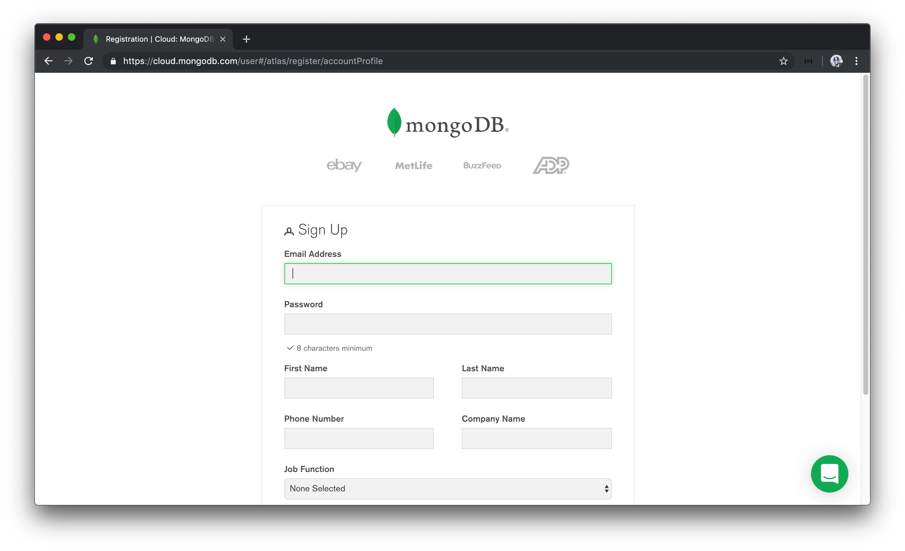

### Create a cluster

Once an account has been created, we'll be redirected and prompted to create our very first cluster.

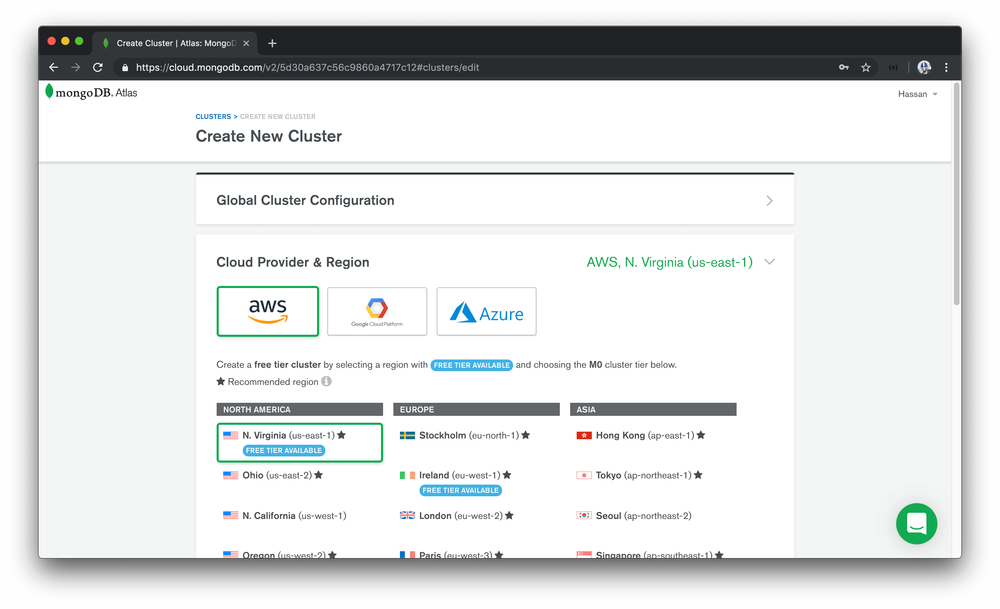

MongoDB Atlas recommends a lot of their popular options but they do give us the capability of customizing how our cluster is to be set up. We won't make any configuration changes and keep the default options that have already been selected.

> MongoDB Atlas allows for the creation and deployment of one `Free Tier` cluster per Atlas project. `Free Tier` clusters never expire and provide all the features and functionality we need for this course.
>
> We recommend selecting a cloud provider and region that provides the capability to create a free tier cluster.

It'll take about 7 - 10 minutes to provision a new `Free tier` cluster. Once ready, we'll be presented with details about our cluster in our MongoDB Atlas dashboard.

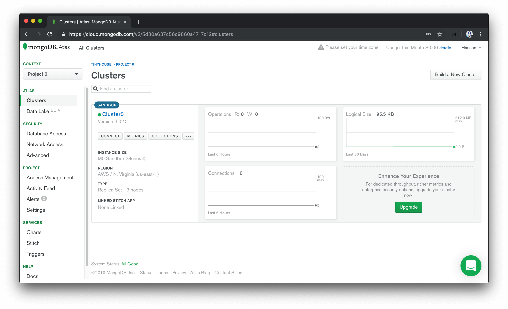

### Create a MongoDB user

We'll need to create a user to interact with databases in our MongoDB Atlas cluster. To do so, we can navigate to the `Database Access` section within the `SECURITY` tab. Here is where we'll add a new MongoDB user and provide both `read` and `write` access to the database cluster.

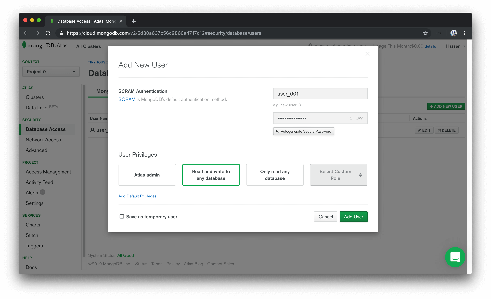

> A MongoDB user is different than an Atlas user. Atlas users can access the entire Atlas dashboard while MongoDB users access databases within clusters.

### Whitelist an IP address

MongoDB Atlas only allows client connections to the cluster from IP addresses that have been whitelisted. To whitelist an IP address, we can navigate to the `Network Access` section within the `SECURITY` tab.

To not concern ourselves with what our client IP addresses would be in development and/or in the deployed state, we'll select `Allow Access From Anywhere` to allow any IP address to access the cluster.

> For databases in production settings that may contain sensitive data, there may be some valid reasons to restrict connections to only a small subset of valid IP addresses. Since this won't be a concern in the course, we'll allow access from anywhere.

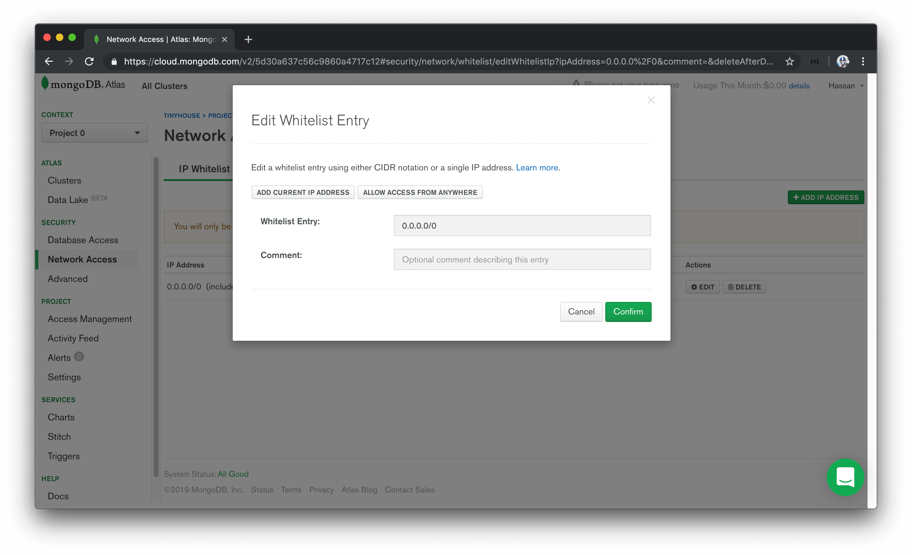

### Add sample data

The last thing we'll do as part of our cluster set-up is introduce sample data to a collection in our cluster. In the `Cluster` main dashboard section, we'll select `Collections` to navigate to the Collections tab of our cluster. We'll look to add our own data and specify a database name of `main` and a collection name of `test_listings`.

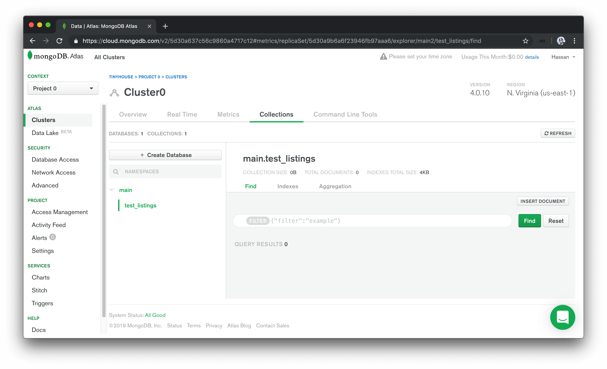

At this moment, we don't have any data in our `test_listings` collection so we'll look to add some data in the Atlas UI. We'll select `Insert Document` and we'll have three fields be added to a new document.

```javascript
_id: ObjectId("....."); // ObjectId
title: "Clean and fully furnished apartment - 5 min away from CN Tower"; // string
address: "2320 Scotchmere Dr, Toronto, ON"; // string
```

As we're inserting new fields here, we're able to specify the types of each field. MongoDB fields could be `null`, `Int64` (64 bit integer), `Int32` (32 bit integer), `code`, `boolean`, etc. This relates to how [MongoDB stores data records as BSON documents (i.e. Binary representation of JSON documents)](https://docs.mongodb.com/manual/core/document/). MongoDB's BSON document structure allows for the capability to store documents in binary form.

We'll have the `_id` field be of the `ObjectId` data type, while `title` and `description` will be of the `string` data type.

> The [`ObjectId`](https://docs.mongodb.com/manual/reference/method/ObjectId/) data type is a 12-byte identifier that is often used for the primary `_id` field of MongoDB documents. MongoDB assigns an `_id` field as a primary index to every document.

Once the document is inserted, we'll be able to see the newly added document in our Atlas collection UI.

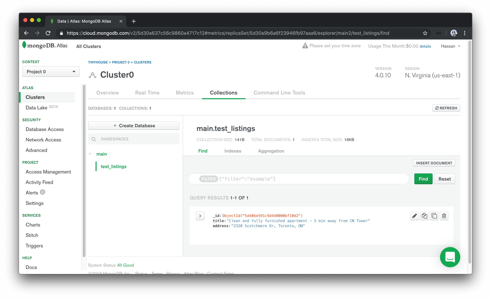

With a MongoDB cluster created that contains sample data, the only thing left for us to do is connect our server application with our MongoDB Atlas cluster. We'll pick this up in the next lesson!

## Connecting the server with MongoDB

> 连接远程数据库，跟着操作即可...

> To connect to MongoDB Atlas from a Node server, we need to ensure we have a secure internet connection. If you are learning this course on an insecure network (such as a public library or a coffee shops' public wi-fi), **MongoDB Atlas may reject your connection request**.

There's a few different libraries and tools that can be used to connect and interact with a MongoDB database from a Node server application. We're going to use the official MongoDB [Node.js Driver](https://mongodb.github.io/node-mongodb-native/) to make our connection. The Node.js MongoDB driver provides both callback and promise based interaction with MongoDB.

We'll head to our terminal and install the `mongodb` driver as a dependency for our server application.

```shell
server $: npm install mongodb
```

The node MongoDB driver is written in native JavaScript so we'll install the accompanying type definitions from the DefinitelyTyped repository.

```shell
server $: npm install -D @types/mongodb
```

With the node MongoDB driver installed, we'll aim to connect our server with the collection in the database we've established in MongoDB Atlas.

### Connecting to the Database

#### Connection URL

We'll create a `database/` folder in `src/` that contains an `index.ts` file where we'll set up and declare the connection between our server and MongoDB.

```shell
src/
  database/
    index.ts
  graphql/
  index.ts
  listings.ts
```

In the `src/database/index.ts` file, our goal is to export a function that when run will make the connection to our database. We'll name this function accordingly and call it `connectDatabase`.

```typescript
export const connectDatabase = () => {};
```

To connect with our database we're going to need to import and use the [`MongoClient`](hhttps://mongodb.github.io/node-mongodb-native/3.2/api/MongoClient.html) constructor from the `mongodb` library.

```typescript
import { MongoClient } from "mongodb";

export const connectDatabase = () => {};
```

The `MongoClient` instance gives us access to a [`connect()`](https://mongodb.github.io/node-mongodb-native/3.2/api/MongoClient.html#.connect) function that takes a URL argument to specify a connection to a MongoDB instance. We'll retrieve this connection URL from MongoDB Atlas.

- In the MongoDB Atlas console, we'll find our cluster and click the `CONNECT` button available in the cluster dashboard.
- We'll select `Connect Your Application` and pick the `Node.js` driver option and the latest version (`3.0 or later`).

We'll then be presented with the connection URL.

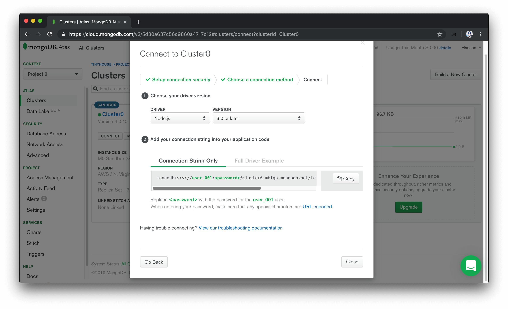

We'll copy the connection url string provided to us and assign it to a `const` variable called `url` in our `src/database/index.ts` file.

```typescript
import { MongoClient } from "mongodb";

const url = `mongodb+srv://user_001:<password>@cluster0-mbfgp.mongodb.net`;

export const connectDatabase = () => {};
```

The connection url string contains details about the database user, the user's password (though not provided since the password is a protected credential), and the `cluster` we're making the connection to.

We'll extrapolate the user, password, and cluster portions of the string to their own respective `const` variables.

```typescript
import { MongoClient } from "mongodb";

const user = "user_001";
const userPassword = "";
const cluster = "cluster0-mbfgp";

const url = `mongodb+srv://${user}:${userPassword}@${cluster}.mongodb.net`;

export const connectDatabase = () => {};
```

We can get the password of the MongoDB user in the `SECURITY` section of MongoDB Atlas. We'll navigate to `Database Access` under the `SECURITY` tab, find the particular user we want. We'll auto-generate a new password, copy the password value, and assign it to the `userPassword` constant variable we've set up.

```typescript
import { MongoClient } from "mongodb";

const user = "user_001";
const userPassword = "XXXXXX"; // user password
const cluster = "cluster0-mbfgp";

const url = `mongodb+srv://${user}:${userPassword}@${cluster}.mongodb.net`;

export const connectDatabase = () => {};
```

> It's especially important to never commit or expose database configuration variables. In this case, we're simply pasting the values here to verify our connection works in this lesson before we decide to extrapolate it. Database configuration variables should never be committed directly to source code!

#### `MongoClient`

With the connection URL available to us, let's use the `MongoClient` constructor to connect to our Mongo cluster.

In our `connectDatabase()` function, we'll run the `connect()` function from the `MongoClient` instance and pass in the connection url. This will return a new Mongo Client instance with which we'll assign to a `const` variable called `client`.

```typescript
import { MongoClient } from "mongodb";

const user = "user_001";
const userPassword = "XXXXXX";
const cluster = "cluster0-mbfgp";

const url = `mongodb+srv://${user}:${userPassword}@${cluster}.mongodb.net`;

export const connectDatabase = () => {
  const client = MongoClient.connect(url);
};
```

The `connect()` function is asynchronous. We want to assign the _result_ of the asynchronous function to the `client` variable, so we'll use the `await` syntax here to achieve this. Since the `await` keyword can only be used within an `async` function, we'll declare that our `connectDatabase()` function is asynchronous.

```typescript
import { MongoClient } from "mongodb";

const user = "user_001";
const userPassword = "XXXXXX";
const cluster = "cluster0-mbfgp";

const url = `mongodb+srv://${user}:${userPassword}@${cluster}.mongodb.net`;

export const connectDatabase = async () => {
  const client = await MongoClient.connect(url);
};
```

Documentation from the node MongoDB driver often shows passing a `{ useNewUrlParser: true }` option to a `MongoClient.connect()` function. This is to ensure compatibility with parsing of the connection url between the current version of our Node MongoDB driver and the version of MongoDB being used in Atlas. We'll follow along and specify the `useNewUrlParser` option.

```typescript
import { MongoClient } from "mongodb";

const user = "user_001";
const userPassword = "XXXXXX";
const cluster = "cluster0-mbfgp";

const url = `mongodb+srv://${user}:${userPassword}@${cluster}.mongodb.net`;

export const connectDatabase = async () => {
  const client = await MongoClient.connect(url, {
    useNewUrlParser: true
  });
};
```

As of recently, when we start our server with the above connection, a deprecation warning is shown in our terminal logs encouraging us to use a new `Server Discover and Monitoring engine`. To do so, we can pass a `{ useUnifiedTopology: true }` option to the `MongoClient.connect()` function constructor.

```typescript
import { MongoClient } from "mongodb";

const user = "user_001";
const userPassword = "XXXXXX";
const cluster = "cluster0-mbfgp";

const url = `mongodb+srv://${user}:${userPassword}@${cluster}.mongodb.net`;

export const connectDatabase = async () => {
  const client = await MongoClient.connect(url, {
    useNewUrlParser: true,
    useUnifiedTopology: true
  });
};
```

> In upcoming screencast videos, you may see the `MongoClient.connect()` constructor function without the `useUnifiedTopology` option defined. Be sure to define the `useUnifiedTopology` option if you're interested in avoiding the MongoClient connection deprecation warning.

From the newly created `client`, we can access the databases within our cluster with the [`client.db()`](https://mongodb.github.io/node-mongodb-native/3.2/api/MongoClient.html#db) method. Let's retrieve the database we've created named `main` from our cluster and assign the result to a `db` constant variable:

```typescript
import { MongoClient } from "mongodb";

const user = "user_001";
const userPassword = "XXXXXX";
const cluster = "cluster0-mbfgp";

const url = `mongodb+srv://${user}:${userPassword}@${cluster}.mongodb.net`;

export const connectDatabase = async () => {
  const client = await MongoClient.connect(url, {
    useNewUrlParser: true,
    useUnifiedTopology: true
  });
  const db = client.db("main");
};
```

Though we could return this `db` value directly from our function, we will aim to return a map of the collections from the database. We'll return an object that contains a reference to the collections we have in our database. Since we only have a `test_listings` collection in our database, we'll return an object with a `listings` key that references the `test_listings` collection in our database. We can access the collections from the `db` object with the [`db.collection()`](https://mongodb.github.io/node-mongodb-native/3.2/api/Db.html#collection) function.

Our `src/database/index.ts` file will now look like the following.

```typescript
import { MongoClient } from "mongodb";

const user = "user_001";
const userPassword = "XXXXXX";
const cluster = "cluster0-mbfgp";

const url = `mongodb+srv://${user}:${userPassword}@${cluster}.mongodb.net`;

export const connectDatabase = async () => {
  const client = await MongoClient.connect(url, {
    useNewUrlParser: true,
    useUnifiedTopology: true
  });
  const db = client.db("main");

  return {
    listings: db.collection("test_listings")
  };
};
```

#### `src/index.ts`

With our database connection function established, let's look to have our Express Server execute the database connection when our app is being instantiated.

To be able to run the `connectDatabase()` function the minute our server starts, we'll slightly configure how our `src/index.ts` file is shaped. To make things a little more apparent, we'll create a `mount()` function that accepts the Express `app` instance. We'll dictate that this `mount()` function will be the parent function to run to essentially start our Node Express server.

The `mount()` function will accept the Express `app` instance and do what we've done before by instantiating the Apollo Server, applying the necessary middleware, and having our app listen on the appropriate port. The "type" of the Express app instance will be the `Application` interface that we'll import from the `express` declaration file. This will have our `src/index.ts` file look like the following:

```typescript
import express, { Application } from "express";
import { ApolloServer } from "apollo-server-express";
import { typeDefs, resolvers } from "./graphql";

const port = 9000;

const mount = (app: Application) => {
  const server = new ApolloServer({ typeDefs, resolvers });

  server.applyMiddleware({ app, path: "/api" });
  app.listen(port);

  console.log(`[app]: http://localhost:${port}`);
};

mount(express());
```

We'll now import the `connectDatabase()` function from the `src/database/` folder. At the beginning of our `mount()` function, we'll run the `connectDatabase()` function and assign the result to a `const` variable that we'll call `db`. We'll want the result of the asynchronous `connectDatabase()` function to be assigned to the `db` variable so we'll use the `async/await` syntax for our `mount()` function as well.

```typescript
import express, { Application } from "express";
import { ApolloServer } from "apollo-server-express";
import { connectDatabase } from "./database";
import { typeDefs, resolvers } from "./graphql";

const port = 9000;

const mount = async (app: Application) => {
  const db = await connectDatabase();

  // ...
};

mount(express());
```

We're interested in having all our resolver functions in our GraphQL API be able to interact with the `db` object. This is because any reading or updates we intend to make, we'll want to make it towards the `test_listings` collection in the database in our MongoDB cluster.

This is where we can take advantage of the [`ctx` (i.e. context) argument](https://www.apollographql.com/docs/apollo-server/essentials/data/#context-argument) within our resolver functions. The context argument is an object that is shared by _all_ resolvers in a GraphQL API. The context argument is useful in passing information that all or many resolvers may need such as database connections.

In our Apollo Server constructor, we'll introduce a third option labeled `context`. The Apollo Server constructor gets called with _every_ request so we're able to set the context based off request details if we're interested but in our case, we'll simply just pass in the `db` object.

```typescript
import express, { Application } from "express";
import { ApolloServer } from "apollo-server-express";
import { connectDatabase } from "./database";
import { typeDefs, resolvers } from "./graphql";

const port = 9000;

const mount = async (app: Application) => {
  const db = await connectDatabase();
  const server = new ApolloServer({
    typeDefs,
    resolvers,
    context: () => ({ db })
  });

  // ...
};

mount(express());
```

All our resolvers should now have access to the connected database as part of `context`.

Before we begin to change our existing query and mutation to interact with our MongoDB collection, we'll do a quick check to see if we're able to connect to the MongoDB cluster. We'll look to query the sample listing document we've set up in the listings (`test_listings`) collection in our database.

We'll make our first query at the end of our `mount()` function in the `src/index.ts` file. We'll look to find all the listing documents in our listings (`test_listings`) collection and assign the result to a `const` variable called `listings`. To achieve this, we'll use the MongoDB [`find()` method](https://docs.mongodb.com/manual/reference/method/db.collection.find/).

The `find()` method is used to find all documents that match a query parameter. In our case, we'll specify an empty query parameter to have all documents in our listings collection (`test_listings`) be returned. To ensure an array of documents is to be returned, we'll use the MongoDB [`toArray()` function](https://docs.mongodb.com/manual/reference/method/cursor.toArray/) at the end of the query `find()` statement.

We'll then place a `console.log()` to survey the value of the `listings` `const` variable.

```typescript
import express, { Application } from "express";
import { ApolloServer } from "apollo-server-express";
import { connectDatabase } from "./database";
import { typeDefs, resolvers } from "./graphql";

const port = 9000;

const mount = async (app: Application) => {
  const db = await connectDatabase();

  // ...

  const listings = await db.listings.find({}).toArray();
  console.log(listings);
};

mount(express());
```

When we start our server, we'll be presented with a log message in our terminal that shows the sample listing document we've added to the Atlas `test_listings` collection! This shows that we've successfully connected our server to MongoDB.

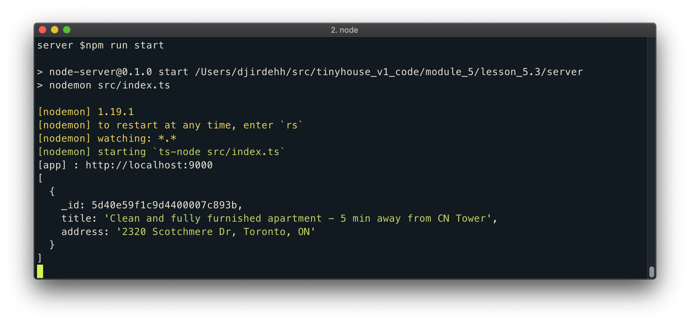

In the next lesson, we'll provide type definitions for the collection objects available to us on the server.

## TypeScript Generics and adding types to our Collections

> 通过泛型的加持，让Collection拥有正确的类型

todo: 不是很理解，需要最近再次查阅

Let's bring the benefit of TypeScript to our MongoDB functionalities in our server code. What we'll essentially need to do is create type definitions for the database collections we want to access in our server. We'll create these type definitions in a new file called `types.ts` under a `src/lib/` folder. This is where we'll keep any type definitions that are to be used in our code in multiple different areas.

```shell
server/
  src/
    database/
    graphql/
    lib/
      types.ts
    index.ts
    listings.ts
  // ...
```

At this moment, our database only contains a single collection (`test_listings`) geared towards storing documents of listing data. In the `src/lib/types.ts` file, we'll create an interface that resembles the shape of a document in our listings collection. This will look very similar to what we had before when we created an interface for our mock listings array.

```typescript
export interface Listing {
  id: string;
  title: string;
  image: string;
  address: string;
  price: number;
  numOfGuests: number;
  numOfBeds: number;
  numOfBaths: number;
  rating: number;
}
```

In a MongoDB document, the main identifier field, by default, is a little unique. First, it's prefixed with an underscore so it's actually `_id`. In addition, it usually has a unique data type - `ObjectId`.

The [`ObjectId` data type](https://docs.mongodb.com/manual/reference/method/ObjectId/) is a unique 12-byte identifier which by default is generated by MongoDB as the primary key for a document in a collection. `ObjectId` plays a role in how documents can be searched, filtered, and sorted in a collection. Since our listing documents in our collection is to have the `_id` field, we'll declare this field in our `Listing` interface and give it a type value of `ObjectID` which is provided to us from the type definitions of the Node MongoDB driver.

```typescript
import { ObjectId } from "mongodb";

export interface Listing {
  _id: ObjectId;
  title: string;
  image: string;
  address: string;
  price: number;
  numOfGuests: number;
  numOfBeds: number;
  numOfBaths: number;
  rating: number;
}
```

We'll now create an interface that will help shape the object being returned from our `connectDatabase()` function in the `src/database/index.ts` file. We'll establish this as a new interface called `Database`.

```typescript
import { ObjectId } from "mongodb";

interface Listing {
  // ...
}

interface Database {}
```

Since our database object returned from the `connectDatabase()` contains a single listing collection, we can specify that in our `Database` interface and provide it a type value of `Collection`. The `Collection` interface will also be imported from the `mongodb` library.

```typescript
import { Collection, ObjectId } from "mongodb";

interface Listing {
  // ...
}

interface Database {
  listings: Collection;
}
```

At this moment, we haven't done anything of significance since our app already infers that the `listings` collection property from our `connectDatabase()` function is of type `Collection`. The `Collection` interface, however, is a _generic_ and accepts a type variable (i.e. parameter). We can add the `Listing` interface we've created as the type parameter of the `Collection` interface we've assigned as the type of the `listings` field.

Our `src/lib/types.ts` will now look like the following:

```typescript
import { Collection, ObjectId } from "mongodb";

export interface Listing {
  _id: ObjectId;
  title: string;
  image: string;
  address: string;
  price: number;
  numOfGuests: number;
  numOfBeds: number;
  numOfBaths: number;
  rating: number;
}

export interface Database {
  listings: Collection<Listing>;
}
```

We'll now take a bit of a tangent to better explain what we've just done with the use of the `Collection` generic.

## TypeScript Generics

### `identity<T>()`

[TypeScript generics](https://www.typescriptlang.org/docs/handbook/generics.html) is one piece of TypeScript that often confuses newcomers since it makes TypeScript code appear a lot more complicated than it actually is.

First and foremost, [generics](https://en.wikipedia.org/wiki/Generic_programming) is a tool/programming method that exists in languages like C# and Java and is geared to help create reusable components that can work with a variety of different types. Generics make this possible by allowing the abstraction of types used in functions or variables. TypeScript adopts this pattern by allowing us to create code that can work with different types.

We'll go through a simple example extrapolated from the [TypeScript documentation](https://www.typescriptlang.org/docs/handbook/generics.html) to illustrate the basics of generics. Assume we had a function called `identity()` that received an argument and returned said argument. Since it's expected to return what it receives, we can specify the type of the argument and the value returned by the function to be the same (e.g. `number`).

```typescript
const identity = (arg: number): number => {
  return arg;
};

identity(5); // arg type and return type = number
identity("5"); // ERROR
```

If we tried to change the return type of the function, TypeScript will display a warning and rightly so since it infers the type of the parameter being returned from the function.

What if we wanted the `identity()` function to be reusable for different types? One thing we _could_ try to do is specify [`Union Types`](https://www.typescriptlang.org/docs/handbook/advanced-types.html#union-types) where the argument type and returned type could be one of many types. For example, we could say the function argument can accept a `number` or a `string` and return either a `number` or a `string`.

```typescript
const identity = (arg: number | string): number | string => {
  return arg;
};

identity(5); // arg type and return type = number
identity("5"); // arg type and return type = string
```

Though this would work in certain cases, the example above won't be reusable especially if we don't know the type of the argument we'll pass in.

Another approach we could take that would work for all types is to use the `any` type.

```typescript
const identity = (arg: any): any => {
  return arg;
};

identity(5); // arg type and return type = number
identity("5"); // arg type and return type = string
```

Using `any` would work but it isn't ideal since we won't be able to constrain what arguments the function accepts or infer what the function is to return.

Here is where generics and the capability of passing a type variable comes in. Just like how we've said `identity()` can accept an argument, we can also say that `identity()` is to accept a _type variable_, or in other words a type parameter or type argument. In TypeScript, we can pass type variables with the angle brackets syntax - `<>`. Here's an example of having the `identity()` function accept a type variable denoted with the letter `T`.

```typescript
const identity = <T>(arg: any): any => {
  return arg;
};
```

Just like how the value argument is available in the function, the _type_ argument is available in the function as well. We could say that whatever type variable is passed will be the type of the argument and the return type of the function.

```typescript
const identity = <T>(arg: T): T => {
  return arg;
};

identity<number>(5); // arg type and return type = number
identity<string>("5"); // arg type and return type = string
identity<any>({ fresh: "kicks" }); // arg type and return type = any
```

> In the example above, TypeScript will be smart enough to recognize the value of the type variable `T`, without always specifying a type value (e.g. `<any>`). This only works in simple cases. In more complicated cases, we'll need to ensure type variables are being passed in.

#### Generic Interfaces

Generics can be used extensively and aren't only specific to functions. Assume we wanted to have our `identity()` function create an object that has a `field` property with the value of `arg`.

```typescript
const identity = <T>(arg: T): T => {
  const obj = {
    field: arg
  };
  return arg;
};
```

Assume we wanted to type constrain the `obj` created to a particular Interface type. **TypeScript type aliases and interfaces also accept type variables**, so we could have an `IdentityObj` interface created above the function that sets the type of a `field` property to a type variable being passed in.

```typescript
interface IdentityObj<T> {
  field: T;
}

const identity = <T>(arg: T): T => {
  const obj = {
    field: arg
  };
  return arg;
};
```

In the `identity()` function, we can define the type of `obj` as the `IdentityObj` interface and pass the type variable along. We can also have the function then return the `field` property from `obj` to conform to the expected return type of the `identity()` function.

```typescript
interface IdentityObj<T> {
  field: T;
}

const identity = <T>(arg: T): T => {
  const obj: IdentityObj<T> = {
    field: arg
  };
  return obj.field;
};
```

#### Default generic values

TypeScript allows for the capability to have default generic type values (i.e. [generic parameter defaults](https://www.typescriptlang.org/docs/handbook/release-notes/typescript-2-3.html#generic-parameter-defaults)). Here's an example of having our `identity()` function and `IdentityObj` interface assign a default type value of `any` to the type variable that can be passed in.

```typescript
interface IdentityObj<T = any> {
  field: T;
}

const identity = <T = any>(arg: T): T => {
  const obj: IdentityObj<T> = {
    field: arg
  };
  return obj.field;
};
```

Now if a type variable isn't defined when using the `identity()` function and the compiler isn't able to infer what the type variable might be, it'll simply be set to `any`.

By convention, the letter `T` is often used to infer a type variable and is most likely due to the fact it stands for Type. We could very well use any letter we want - `U` `V`, etc. In certain cases, some prefer to extrapolate the type variable name especially if one might pass in multiple type variables. Here's an example of the `identity()` function being able to accept two type variables - `TData` and `TVariables`.

```typescript
interface IdentityObj<T = any> {
  field: T;
}

const identity = <TData = any, TVariables = any>(arg: TData): TData => {
  const obj: IdentityObj<TData> = {
    field: arg
  };
  return obj.field;
};
```

Notice how much more complicated the above code appears to be? It's not that difficult if one recognizes what's happening and can trace things step by step.

We'll stop here for now. We'll remove this example `identity()` function and look back at the use of the `Collection` interface for the listings collection in our `connectDatabase()` function.

#### Collection<Listing>

In the `src/lib/types.ts` file, why is the passing of the `Listing` interface as a type variable helpful in the context of using the `Collection` interface for the `listings` property?

```typescript
import { Collection, ObjectId } from "mongodb";

interface Listing {
  // ...
}

interface Database {
  listings: Collection<Listing>;
}
```

If we take a look at the [`Collection` interface in our `mongodb` type definitions file](https://github.com/DefinitelyTyped/DefinitelyTyped/blob/master/types/mongodb/index.d.ts), we can see that it takes a type variable labeled `TSchema` that has a default type value of `Default`.

```typescript
// https://github.com/DefinitelyTyped/DefinitelyTyped/blob/master/types/mongodb/index.d.ts

export interface Collection<TSchema = Default> {
  // ...
}
```

When we take a look at the `Default` type in the [type declaration file](https://github.com/DefinitelyTyped/DefinitelyTyped/blob/master/types/mongodb/index.d.ts), we'll recognize that it's equal to the type of `any`.

```typescript
// https://github.com/DefinitelyTyped/DefinitelyTyped/blob/master/types/mongodb/index.d.ts

type Default = any;
```

When we do a quick search of `TSchema`,we can see some functions that utilize it in such a way that the return statement of the function takes advantage of the type variable being passed in.

When we pass in the `Listing` interface to `Collection`, this will help ensure that many MongoDB methods ([`find()`](https://docs.mongodb.com/manual/reference/method/db.collection.find/), [`findOne()`](https://docs.mongodb.com/manual/reference/method/db.collection.findOne/index.html), etc.) on a collection will utilize the `Listing` type from the returned result. We'll see an example of this when we use the `Database` interface type we've just created.

In the `src/database/index.ts` file, let's import the `Database` interface from the newly created types file and look to specify the type of the returned statement from the `connectDatabase()` function. Our `connectDatabase()` function is asynchronous so we can't simply specify the return type of the value we expect, we have to say it's going to be a _Promise_ of the expected return. TypeScript natively provides a `Promise` interface which accepts a type variable with which will be the type of the resolved promise value.

We'll declare the return type of the `connectDatabase()` function to be of `Promise<Database>`.

```typescript
// ...
import { Database } from "../lib/types";

// ...

export const connectDatabase = async (): Promise<Database> => {
  // ....
};
```

We've stated that our `connectDatabase()` function when resolved will be an object that resembles the shape of the `Database` interface type. Our `listings` field in the object being returned will now be inferred to be a `Collection` of `Listing`.

> Instead of defining an explicit return type of `connectDatabase()`, we could have very well passed in the `Listing` interface as a type variable to the `db.collection()` method.
>
> `db.collection<Listing>('test_listings`).
>
> This will achieve the same result.

We'll head to the `src/index.ts` file and survey the value of `listings` from our MongoDB `find()` function we've set up in the last lesson to verify our MongoDB connection. We can see that the `listings` variable is now appropriately type defined as an array of items where each item is of the `Listing` interface type!

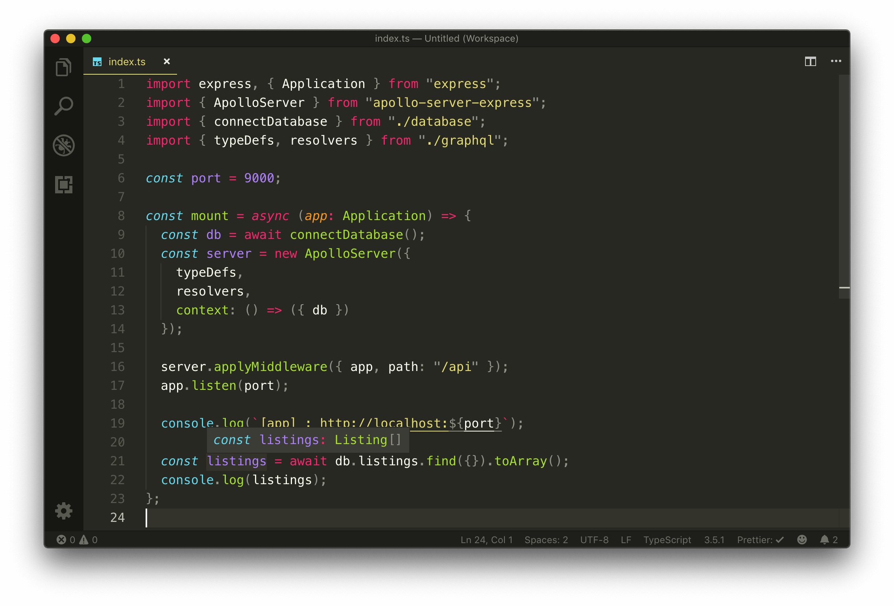

Since we haven't made any functional changes in this lesson, when we start the server - our server should work as expected and `console.log` the sample listings data in our collection. We'll no longer need to verify our database connection works so we'll remove the query we've made to retrieve all listing documents from our collection as well the `console.log()` method in our `mount()` function.

## Setting Up Env Variables

> 这部分以前也没有接触过，学习过后对环境变量的理解上了一个台阶。

In the last lesson, we hard-coded MongoDB environment configuration values directly into our code. We created a `user` variable, a `userPassword` variable, and a `cluster` variable in our `src/database/index.ts` file. We obtained the values of these variables directly from our MongoDB Atlas dashboard.

Having these database configuration values in our code is a bad idea for a couple of reasons.

- Database environment variables should be confidential so we should be wary of having our values publicly available especially if we start to consider pushing our source code to an online repository.
- As the name suggests, environment variables are for setting up our app's _runtime environment_. They don't have anything to do with our app's logic. What if we wanted to change our MongoDB's user password when our application has already been built? We would want to update the environment variable without having to go back into the source code and changing it. This will help limit the need to modify and redeploy an app due to changes in configuration data when an app is already deployed.

### `process` and `dotenv`

In Node, [`process`](https://nodejs.org/api/process.html#process_process) is a global object with information about the currently running process. [`process.env`](https://nodejs.org/api/process.html#process_process_env) is an object within `process` that contains information representative of the state of the Node environment. During runtime, the reference to an environment variable within `process.env` is replaced with the actual value of the variable.

Environment variables defined within `process` can be specified both in a development setting as well as in a production setting. The [`dotenv` library](https://github.com/motdotla/dotenv) is a popular package that helps load variables from a `.env` file for Node.js projects, which is helpful during development.

We'll head to the terminal and install the `dotenv` library as a development dependency. We'll also install the type declaration file of `dotenv` as a development dependency.

```shell
server $: npm install -D dotenv @types/dotenv
```

> We're installing `dotenv` library as a `devDependency` since when we deploy our app, our cloud management solution - [Heroku](https://www.heroku.com/) will automatically save environment variables defined in the dashboard into `process.env`. As a result, we won't need the `dotenv` library in our production code. However, if you choose to use another method to deploy your app that may require a `.env` file, you might need to install `dotenv` as a regular dependency!

With `dotenv` installed, we'll create a `.env` file in the root of our project directory.

```shell
server/
  // ...
  .env
```

In this `.env` file, we can specify the different values that we'd want to be passed in as environment variables. Convention often finds us defining these variables with capital letters.

We'll define three environment configuration variables, `DB_USER`, `DB_USER_PASSWORD`, and `DB_CLUSTER`. We'll retrieve the values of the DB configuration variables from our MongoDB Atlas dashboard.

```shell
DB_USER=user_001
DB_USER_PASSWORD=XXXXX
DB_CLUSTER=cluster0-mbfgp
```

In certain environments (Heroku for example), we can specify the port in which the app is to run as an environment variable. With that in mind, we'll also specify a `PORT` environment variable as well which would be the port our app is to run on.

```shell
PORT=9000
DB_USER=user001
DB_USER_PASSWORD=XXXXX
DB_CLUSTER=cluster-kli81
```

### `src/index.ts`

Next, we'll modify our code to use the values from our `.env` file. First, we'll require and configure `dotenv` as early as possible in our application in the `src/index.ts` file. To do so and before any imports, we'll use the `require` syntax to introduce the library and run the `config()` function. This helps us avoid any ESLint warnings of running code before the import of other files and by doing so as early as possible, this also helps prevent compilation issues where other imported files don't pick up environment variables.

```typescript
require("dotenv").config();

import express, { Application } from "express";
import { ApolloServer } from "apollo-server-express";
import { connectDatabase } from "./database";
import { typeDefs, resolvers } from "./graphql";

const mount = async (app: Application) => {
  // ...
};

mount(express());
```

`process.env` will now have the keys and values defined from our `.env` file during development. In the `src/index.ts` file, we can use the `process.env.PORT` value to reference the port defined in our environment variables in the `app.listen()` function and the `console.log()` method.

```typescript
require("dotenv").config();

import express, { Application } from "express";
import { ApolloServer } from "apollo-server-express";
import { connectDatabase } from "./database";
import { typeDefs, resolvers } from "./graphql";

const mount = async (app: Application) => {
  // ...

  app.listen(process.env.PORT);

  console.log(`[app] : http://localhost:${process.env.PORT}`);
};

mount(express());
```

### `src/database/index.ts`

In the `src/database/index.ts` file, we'll reference the values necessary for our MongoDB connection from `process.env`. We'll also remove the hard-coded variables we've specified before.

```typescript
import { MongoClient } from "mongodb";
import { Database } from "../lib/types";

const url = `mongodb+srv://${process.env.DB_USER}:${process.env.DB_USER_PASSWORD}@${process.env.DB_CLUSTER}.mongodb.net`;

export const connectDatabase = async (): Promise<Database> => {
  // ...
};
```

### `.gitignore`

Like we've mentioned before, environment variables should never be committed to source code. An easy way to prevent `git` from committing the entire `.env` file is by introducing a [`.gitignore` file](https://help.github.com/en/articles/ignoring-files#create-a-local-gitignore) that references the files we don't want to be committed (e.g. `.env`).

We'll create a `.gitignore` file at the root of our project. In addition to not ever committing `.env` files there's a few other files and folders that usually shouldn't be committed such as the `node_modules` folder, the `build/` folder from our TypeScript compilation process, and any `npm` or `yarn` debug logs. Here we'll paste a series of files and folders we think shouldn't be committed but you are more than welcome to customize it as you see fit.

    # dependencies
    node_modules/
    
    # production
    build/
    
    # misc
    .DS_Store
    
    # environment variables
    .env
    
    npm-debug.log*
    yarn-debug.log*
    yarn-error.log*

If we start the server and attempt to connect to the database as we've done before, everything should continue to work as expected.

> In the code samples provided with Part I of this course, we _won't be committing a .env file of configuration variables_. You will need to ensure a `.env` file is created in the root of the project directory and declare the `PORT`, `DB_USER`, `DB_USER_PASSWORD`, and `DB_CLUSTER` environment variables. The database configuration variables should be retrieved from your MongoDB Atlas dashboard.

## Seeding mock data to the database

> 写了一个脚本代码，将本地的mock数据提交到数据库中。

Now that we've successfully connected our app to our MongoDB instance, we'll want to change the query and mutation we have in our app to interact with data in our database. Before we do that, we'll begin by first seeding our database with the same mock data we've used in the previous lessons.

We aim to have a script that will make it easy for us to populate the database with some mock data for development. This will help us avoid navigating to the MongoDB Atlas dashboard to introduce mock data whenever needed.

We'll create this script in a `seed.ts` file in a new `temp/` folder in our root project directory.

```shell
server/
  temp/
    seed.ts
  // ...
```

TypeScript may warn us that we're introducing a TypeScript file outside of the `rootDir/`, which are the files we want TypeScript code to be compiled (i.e. the files in the `src/` folder). The reason we're placing the `seed.ts` file outside of our `src/` folder (which is where our app is being instantiated and run) is because the `seed()` function we'll create _is to only be used for development_. The `seed()` function is to help populate mock data in our database so we can test the rest of our app. When we get to deploying our app, we won't need this seed file and parent temporary folder.

Since the code in the seed file isn't needed for our app, we don't need TypeScript to compile it to valid JavaScript. In the `tsconfig.json` file, we can specify files and folders we don't want to be included in the TypeScript compilation process with the `exclude` option. We'll specify that the `temp` folder should be excluded from our TypeScript compilation.

```json
{
  "compilerOptions": {
    "target": "es6",
    "module": "commonjs",
    "rootDir": "./src",
    "outDir": "./build",
    "esModuleInterop": true,
    "strict": true
  },
  "exclude": ["temp"]
}
```

### `seed.ts`

In the `temp/seed.ts` file, we'll first require the `dotenv` library and configure it since our soon to be created `seed()` function is going to use the `connectDatabase()` function in our app. The database credentials used in the `connectDatabase()` function are referenced from environment variables so we'll need `dotenv` configured.

```typescript
require("dotenv").config();
```

Next, we'll create a simple asynchronous `seed()` function that has a `try` and `catch` block. The `try` statement will simply log a message to the console noting that the seed function is being run and in the `catch` statement we'll throw an `Error`.

At the bottom of the file, we'll also run the `seed()` function.

```typescript
require("dotenv").config();

const seed = async () => {
  try {
    console.log(`[seed] : running...`);
  } catch (error) {
    throw new Error("failed to seed database");
  }
};

seed();
```

Notice how we're using JavaScript's [`try`...`catch` statement](https://developer.mozilla.org/en-US/docs/Web/JavaScript/Reference/Statements/try...catch) here? Usually, when a code encounters an error it just crashes and outputs the error to a console if one is available. But with the `try`...`catch` pattern, we have a chance to _catch_ that error and choose how to handle it. We might want to just `console.log` the error, log the error in our database for reference, or in our `seed()` function - we'll simply throw another error and stop the program execution.

The `try`...`catch` pattern works in the following steps:

1.  The code in `try {...}` is executed.
2.  If there are no errors, then the `catch (error) {...}` is ignored.
3.  If an error does occur, the `try` execution is stopped and the control flows to the beginning of `catch (error)`. The `error` argument of `catch` contains details about the error that has occurred.

In our `seed()` function, we'll now connect to our MongoDB Atlas database just like we've done in the `src/index.ts` file. We'll import the `connectDatabase()` function, run the function and assign the result to a `db` constant.

```typescript
require("dotenv").config();

import { connectDatabase } from "../src/database";

const seed = async () => {
  try {
    console.log(`[seed] : running...`);

    const db = await connectDatabase();
  } catch (error) {
    throw new Error("failed to seed database");
  }
};

seed();
```

We'll then copy the mock listings data from our `src/listings.ts` file and paste it directly after our database connection.

```typescript
require("dotenv").config();

import { connectDatabase } from "../src/database";

const seed = async () => {
  try {
    console.log(`[seed] : running...`);

    const db = await connectDatabase();
    export const listings = [
      {
        id: "001",
        title: "Clean and fully furnished apartment. 5 min away from CN Tower",
        image:
          "https://res.cloudinary.com/tiny-house/image/upload/v1560641352/mock/Toronto/toronto-listing-1_exv0tf.jpg",
        address: "3210 Scotchmere Dr W, Toronto, ON, CA",
        price: 10000,
        numOfGuests: 2,
        numOfBeds: 1,
        numOfBaths: 2,
        rating: 5
      }
      // ...
    ];
  } catch (error) {
    throw new Error("failed to seed database");
  }
};

seed();
```

In our `seed()` function, we want the entire mock listings array to be inserted into our `test_listings` collection in our Mongo database. We've specified the type of a listing that resembles the shape of a listing collection document in the `src/lib/types` folder. To make sure we're inserting listings that resemble the shape that we expect, we'll import the `Listing` interface type and define the type of the mock listings array as `Listing[]`.

```typescript
require("dotenv").config();

import { connectDatabase } from "../src/database";
import { Listing } from "../src/lib/types";

const seed = async () => {
  try {
    console.log(`[seed] : running...`);

    const db = await connectDatabase();
    export const listings: Listing[] = [
      {
        id: "001",
        title: "Clean and fully furnished apartment. 5 min away from CN Tower",
        image:
          "https://res.cloudinary.com/tiny-house/image/upload/v1560641352/mock/Toronto/toronto-listing-1_exv0tf.jpg",
        address: "3210 Scotchmere Dr W, Toronto, ON, CA",
        price: 10000,
        numOfGuests: 2,
        numOfBeds: 1,
        numOfBaths: 2,
        rating: 5
      }
      // ...
    ];
  } catch (error) {
    throw new Error("failed to seed database");
  }
};

seed();
```

TypeScript will display an error since the `Listing` interface expects an `_id` field of type `ObjectId` while in our mock listings array we've provided `id` fields of type `string`. To generate a new `ObjectId` value for each of the different listing objects, we can import the `ObjectId` class from the Node MongoDB driver and create a new `ObjectId` instance with `new ObjectId()`.

We'll specify `_id` (instead of `id`) fields for each listing object in our mock data array and provide new `ObjectId` values.

```typescript
require("dotenv").config();

import { ObjectId } from "mongodb";
import { connectDatabase } from "../src/database";
import { Listing } from "../src/lib/types";

const seed = async () => {
  try {
    console.log(`[seed] : running...`);

    const db = await connectDatabase();
    export const listings: Listing[] = [
      {
        _id: new ObjectId(),
        title: "Clean and fully furnished apartment. 5 min away from CN Tower",
        image:
          "https://res.cloudinary.com/tiny-house/image/upload/v1560641352/mock/Toronto/toronto-listing-1_exv0tf.jpg",
        address: "3210 Scotchmere Dr W, Toronto, ON, CA",
        price: 10000,
        numOfGuests: 2,
        numOfBeds: 1,
        numOfBaths: 2,
        rating: 5
      }
      // ...
    ];
  } catch (error) {
    throw new Error("failed to seed database");
  }
};

seed();
```

With our mock `listings` data array available to us, we can simply loop through the array and insert each listing into the database collection with Mongo's [`insertOne()` function](https://docs.mongodb.com/manual/reference/method/db.collection.insertOne/).

We'll place a `console.log` at the end of the `try` statement to notify us when the seed process is made complete.

```typescript
require("dotenv").config();

import { ObjectId } from "mongodb";
import { connectDatabase } from "../src/database";
import { Listing } from "../src/lib/types";

const seed = async () => {
  try {
    console.log(`[seed] : running...`);

    const db = await connectDatabase();
    export const listings: Listing[] = [
      {
        _id: new ObjectId(),
        title: "Clean and fully furnished apartment. 5 min away from CN Tower",
        image:
          "https://res.cloudinary.com/tiny-house/image/upload/v1560641352/mock/Toronto/toronto-listing-1_exv0tf.jpg",
        address: "3210 Scotchmere Dr W, Toronto, ON, CA",
        price: 10000,
        numOfGuests: 2,
        numOfBeds: 1,
        numOfBaths: 2,
        rating: 5
      }
      // ...
    ];

    for (const listing of mockListings) {
      await db.listings.insertOne(listing);
    }

    console.log(`[seed] : success`);
  } catch (error) {
    throw new Error("failed to seed database");
  }
};

seed();
```

With our `seed()` function prepared, we can now introduce an application script that will run the `seed()` function. We'll label this script as the `seed` script and use `ts-node` instead of `nodemon` to run the seed file (this is because we only want to run the `seed` script once at a time, we don't need to watch for changes in our code and re-run the `seed` script).

```json
  "scripts": {
    "start": "nodemon src/index.ts",
    "seed": "ts-node temp/seed.ts",
    "build": "tsc -p ./"
  }
```

Let's run the `seed` script in our terminal to verify our seeding functionality works as expected.

```shell
server $: npm run seed
```

We'll notice the two `console.log` statements in our terminal notifying us that our `seed()` function is running before being made complete.

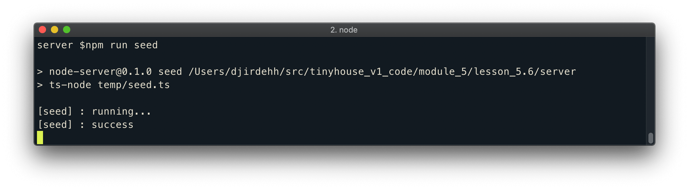

And we'll notice the newly inserted listings in the collections tab of our cluster in MongoDB Atlas!

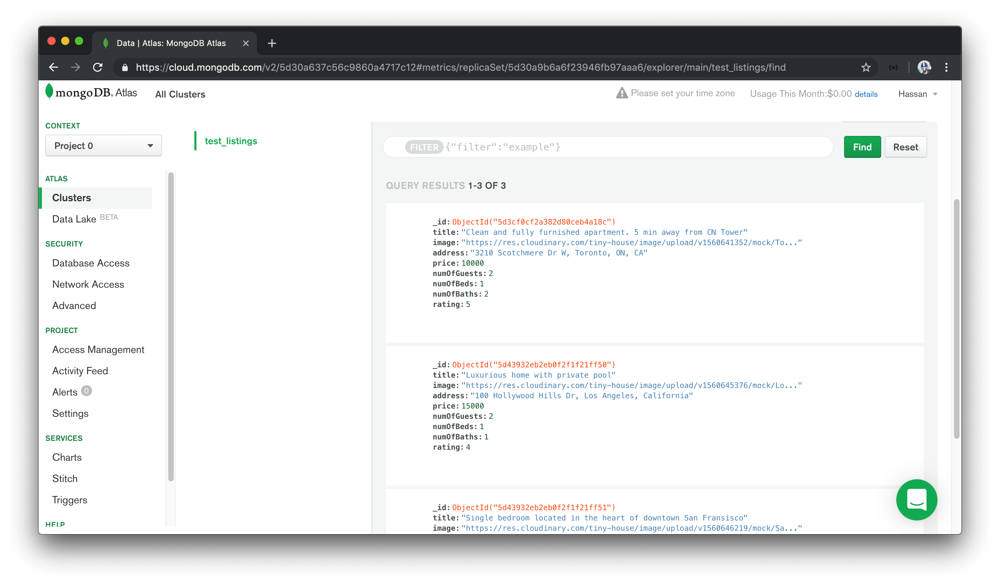

> If the `listing` document that we've introduced a few lessons back (i.e. the `listing` document with just the `_id`, `title`, and `address` fields) still exists in the collection in MongoDB Atlas, we'll remove it from our collection.


## Processing Data from MongoDB

> GraphQL 连接 DB，实现对云上DB中的数据进行CRUD。

In this lesson, we'll modify our GraphQL resolvers to now manipulate and use information from our database. We'll start by modifying the `listings` query field which currently returns the mock `listings` array we've set up in our code when queried.


在本课程中，我们将修改我们的GraphQL解析器，以处理和使用数据库中的信息。我们将从修改`listings`query字段开始，该查询字段当前返回查询时在代码中设置的模拟`listings`数组。

### Query listings

We'll head to the `src/graphql/resolvers.ts` file to update the GraphQL API resolver functions. In our resolvers, we're going to need to access the `db` object created in our `src/index.ts` file. In our Apollo Server instantiation, we've placed the `db` object in our context so we should be able to access the `db` object from all our GraphQL resolvers.

我们将转到src / graphql / resolvers.ts文件来更新GraphQL API解析器功能。在解析器中，我们将需要访问在src / index.ts文件中创建的db对象。在Apollo Server实例中，我们将db对象放置在上下文中，因此我们应该能够从所有GraphQL解析器访问db对象。

[Context is the third positional parameter of a resolver function](https://www.apollographql.com/docs/graphql-tools/resolvers/#resolver-function-signature). The `listings` field resolver doesn't use the first `root` object parameter or expect any arguments to be passed as part of the second parameter. As a result, we'll define the first two function parameters to then access the `ctx` parameter. Since the `root` obj parameter doesn't have any value, we'll state its type to be `undefined`. The arguments parameter of a resolver function is always an object and since no arguments are expected to be passed for the `listings` field, we'll define the type of the arguments option as an empty object literal - `{}`.

“列表”字段解析器不使用第一个“ root”对象参数，也不希望任何参数作为第二个参数的一部分传递。结果，我们将定义前两个函数参数，然后访问`ctx`参数。由于“ root” obj参数没有任何值，因此我们将其类型声明为“ undefined”。解析器函数的arguments参数始终是一个对象，并且由于预计不会为listings字段传递任何参数，因此我们将arguments选项的类型定义为空对象文字-{}。

```typescript
import { IResolvers } from "apollo-server-express";
import { listings } from "../listings";

export const resolvers: IResolvers = {
  Query: {
    listings: (_root: undefined, _args: {}) => {
      return listings;
    }
  },
  Mutation: {
    // ...
  }
};
```

We'll destruct the `db` property from the third context parameter. The type of the `db` object is the `Database` interface we've set up in the `src/lib/types.ts` file. We'll import the `Database` interface and assign the type of the `db` object to the `Database` interface type.

我们将从第三个上下文参数中破坏`db`属性。 db对象的类型是我们在src / lib / types.ts文件中设置的Database接口。我们将导入“数据库”接口，并将“ db”对象的类型分配给“数据库”接口类型。

```typescript
import { IResolvers } from "apollo-server-express";
import { Database } from "../lib/types";
import { listings } from "../listings";

export const resolvers: IResolvers = {
  Query: {
    listings: (_root: undefined, _args: {}, { db }: { db: Database }) => {
      return listings;
    }
  },
  Mutation: {
    // ...
  }
};
```

The `listings` resolver function will use Mongo's [`find()` method](https://docs.mongodb.com/manual/reference/method/db.collection.find/) to return all the documents in our listings collection. The `find()` method allows us to find documents based on a query but we won't provide a query argument since we want the method to return every collection document. We'll also use Mongo's [`toArray()` method](https://docs.mongodb.com/manual/reference/method/cursor.toArray/index.html) to ensure an array of data is to be returned.

We'll use the `async/await` syntax to ensure the result of our asynchronous method is returned.

清单解析器功能将使用Mongo的[find（）方法(https://docs.mongodb.com/manual/reference/method/db.collection.find/)返回清单集中的所有文档。使用find（）方法可以基于查询查找文档，但是由于我们希望该方法返回每个集合文档，因此我们不提供查询参数。我们还将使用Mongo的[toArray（）方法](https://docs.mongodb.com/manual/reference/method/cursor.toArray/index.html)来确保要返回数据数组。

我们将使用`async / await`语法来确保返回异步方法的结果。

```typescript
import { IResolvers } from "apollo-server-express";
import { Database } from "../lib/types";
import { listings } from "../listings";

export const resolvers: IResolvers = {
  Query: {
    listings: async (_root: undefined, _args: {}, { db }: { db: Database }) => {
      return await db.listings.find({}).toArray();
    }
  },
  Mutation: {
    // ...
  }
};
```

Our `listings` query will now return the listings data from our MongoDB collection.

现在，我们的“清单”查询将返回MongoDB集合中的清单数据。

### `deleteListing`

We'll modify the `deleteListing` mutation to delete a listing from our database. In our `deleteListing` resolver function, we'll access the `db` object from the context as we've done in our query. We'll also remove the delete functionality we had in our `deleteListing` resolver that removed a listing object from the mock data array in the `src/listings.ts` file.

我们将修改`deleteListing`突变以从数据库中删除列表。在我们的`deleteListing`解析器函数中，我们将像在查询中一样从上下文访问`db`对象。我们还将删除在deleteListing解析器中使用的删除功能，该功能从src / listings.ts文件中的模拟数据数组中删除了一个列表对象。

```typescript
import { IResolvers } from "apollo-server-express";
import { Database } from "../lib/types";
import { listings } from "../listings";

export const resolvers: IResolvers = {
  Query: {
    // ...
  },
  Mutation: {
    deleteListing: (
      _root: undefined,
      { id }: { id: string },
      { db }: { db: Database }
    ) => {}
  }
};
```

In our `deleteListing` resolver function, we'll use MongoDB's [`findOneAndDelete()` method](https://docs.mongodb.com/manual/reference/method/db.collection.findOneAndDelete/index.html) to allow us to delete a single document based on filter criteria.

The `id` of the listing that is to be deleted is passed in as an argument parameter of the `deleteListing` mutation. We can apply a filter in our `findOneAndDelete()` function to delete the listing in which its ID matches that of the `id` parameter passed in. If we recall, the unique identifying field in a listing document is the `_id` field which is of type `ObjectId`.

将要删除的列表的“ id”作为“ deleteListing”变异的自变量参数传入。我们可以在我们的`findOneAndDelete（）`函数中应用过滤器，以删除其ID与传入的`id`参数的ID匹配的列表。如果我们回想起，列表文档中的唯一标识字段是`_id`字段类型为“ ObjectId”。

Just like how the `ObjectId` class from the Node MongoDB driver allows us to create a new `ObjectId`, it also accepts a string value to convert it to the valid hexadecimal format. We'll run the `findOneAndDelete()` function and apply a filter where we look for the listing in which it's `_id` field is equal to the `ObjectId` format of the passed in `id` argument. The `findOneAndDelete()` function returns an object so we'll assign the returned object to a `deleteRes` constant variable. We'll use the `async/await` syntax to ensure the returned result from the `findOneAndDelete()` is assigned to the `deleteRes` constant variable.


就像Node MongoDB驱动程序中的ObjectId类如何允许我们创建新的ObjectId一样，它也接受字符串值以将其转换为有效的十六进制格式。我们将运行“ findOneAndDelete（）”函数，并在此处查找清单的列表中应用过滤器，该清单的“ _id”字段等于传入的“ id”参数的“ ObjectId”格式。 “ findOneAndDelete（）”函数返回一个对象，因此我们将返回的对象分配给“ deleteRes”常量变量。我们将使用`async / await`语法来确保将`findOneAndDelete（）`返回的结果分配给`deleteRes`常量变量。

```typescript
import { ObjectId } from "mongodb";
import { IResolvers } from "apollo-server-express";
import { Database } from "../lib/types";
import { listings } from "../listings";

export const resolvers: IResolvers = {
  Query: {
    // ...
  },
  Mutation: {
    deleteListing: async (
      _root: undefined,
      { id }: { id: string },
      { db }: { db: Database }
    ) => {
      const deleteRes = await db.listings.findOneAndDelete({
        _id: new ObjectId(id)
      });
    }
  }
};
```

The `value` property of the returned object from the `findOneAndDelete()` method contains the value of the deleted item, when successful. We'll use an `if` statement to verify the `value` property exists. If it does exist, we'll simply have our `deleteListing` function return the `value` property (which is to be the deleted listing itself). If the `value` property doesn't exist, we'll throw an error that says `"failed to delete listing"`.

从findOneAndDelete（）方法返回的对象的value属性在成功时将包含已删除项目的值。我们将使用“ if”语句来验证“ value”属性是否存在。如果确实存在，我们将简单地使我们的`deleteListing`函数返回`value`属性（即被删除的列表本身）。如果value属性不存在，我们将抛出一个错误，提示“无法删除列表”。

```typescript
import { ObjectId } from "mongodb";
import { IResolvers } from "apollo-server-express";
import { Database } from "../lib/types";
import { listings } from "../listings";

export const resolvers: IResolvers = {
  Query: {
    // ...
  },
  Mutation: {
    deleteListing: async (
      _root: undefined,
      { id }: { id: string },
      { db }: { db: Database }
    ) => {
      const deleteRes = await db.listings.findOneAndDelete({
        _id: new ObjectId(id)
      });

      if (!deleteRes.value) {
        throw new Error("failed to delete listing");
      }

      return deleteRes.value;
    }
  }
};
```

With our resolvers updated to now interact with the database, we no longer need the mock `listings` array so we'll remove the import of the mock array in the `src/graphql/resolvers.ts` file and remove the `src/listings.ts` file as well.

随着解析器更新为现在可以与数据库进行交互，我们不再需要模拟`listings`数组，因此我们将在`src / graphql / resolvers.ts`文件中删除模拟数组的导入，并删除`src / listings.ts`文件。

### `Listing`

At this moment, if we started our server and tried to run either the `listings` query or the `deleteListing` mutation, they would actually both fail. This is primarily due to how our `Listing` object type is set up in our GraphQL schema and how our listing document is being returned from the database.

此时，如果我们启动服务器并尝试运行“ listings”查询或“ deleteListing”变异，则它们实际上都将失败。这主要是由于在GraphQL模式中如何设置“清单”对象类型以及如何从数据库返回清单文件。


There's one important point to discuss that we might have not addressed yet. We've mentioned that every field in a GraphQL schema needs to have a resolver function responsible in resolving that field. We have resolver functions for both the `Query` and `Mutation` root object types but what about the `Listing` object type. How are those particular fields being resolved?

有一个重要的讨论要点，我们可能尚未解决。我们已经提到了GraphQL模式中的每个字段都需要具有负责解析该字段的解析器功能。我们为Query和Mutation根对象类型都提供了解析器功能，但是对于Listing对象类型呢？这些特定字段如何解决？

To follow the appropriate standard, in our `src/graphql/resolvers.ts` file, we should be setting up a resolvers map for the `Listing` object type. Let's go ahead and create the new `Listing` object field in our `resolvers` map to better illustrate this.

为了遵循适当的标准，在我们的src / graphql / resolvers.ts文件中，我们应该为Listing对象类型设置一个分解器映射。让我们继续在“解析器”映射中创建新的“ Listing”对象字段，以更好地说明这一点。

```typescript
import { ObjectId } from "mongodb";
import { IResolvers } from "apollo-server-express";
import { Database } from "../lib/types";

export const resolvers: IResolvers = {
  Query: {
    // ...
  },
  Mutation: {
    // ...
  },
  Listing: {}
};
```

Assume we wanted to resolve the `title` field in our `Listing` object type.
假设我们想解析“ Listing”对象类型中的“ title”字段。

```typescript
import { ObjectId } from "mongodb";
import { IResolvers } from "apollo-server-express";
import { Database } from "../lib/types";

export const resolvers: IResolvers = {
  Query: {
    // ...
  },
  Mutation: {
    // ...
  },
  Listing: {
    title: () => {}
  }
};
```

In the root level `listings` and `deleteListing` resolvers, the first positional `obj` argument for each of these fields was `undefined`. In the fields within the `Listing` object type, **the first positional `obj` argument will be defined as whatever the root level fields return**.

假设我们要解析根目录解析器中的title，在每个字段中的第一个位置obj参数是undefined。在“列表”对象类型内的字段中，**第一个位置的“ obj”参数将定义为根级别字段返回的值**。

When we take a look at our schema (in the `src/graphql/typeDefs.ts` file), we know the return type of the `listings` field and `deleteListing` mutation would be the `Listing` object type in some variation or another (`listings` returns an array of `Listing` while `deleteListing` return a single `Listing`).

当我们看一下模式（在src / graphql / typeDefs.ts文件中）时，我们知道listing字段的返回类型和deleteListing变异将是Listing对象类型的某种变体。或另一个（“ listings”返回一个“ Listing”数组，而“ deleteListing”返回一个“ Listing”）。

```typescript
import { gql } from "apollo-server-express";

export const typeDefs = gql`
  type Listing {
    // ...
  }

  type Query {
    listings: [Listing!]!
  }

  type Mutation {
    deleteListing(id: ID!): Listing!
  }
`;
```

When we take a look at the resolver functions of the `listings` and `deleteListing` fields, we see that we have the functions return values. Where do these returned values go? These values become the _object_ argument for the children fields.

当我们看一下“ listings”和“ deleteListing”字段的解析器函数时，我们看到我们有返回值的函数。这些返回的值在哪里？这些值成为子字段的_object_参数。

In the `Listing` object type, the first positional object argument is going to be the `listing` obj returned from the parent fields. This `listing` object is essentially the shape of the listing document in our database collection. We have a type labeled `Listing` in our `src/lib/types` file that is to resemble the shape of a listing collection document. We'll import the `Listing` interface type in our resolvers file and assign it as the type of the `obj` argument of the `title` resolver. Since we know this object is a listing we'll name this object parameter accordingly.

在“清单”对象类型中，第一个位置对象参数将是从父字段返回的“清单” obj。这个“清单”对象本质上是我们数据库集合中清单文件的形状。我们在`src / lib / types`文件中有一个标记为“ Listing`”的类型，类似于列表收集文档的形状。我们将在解析器文件中导入Listing接口类型，并将其分配为title解析器的obj参数的类型。由于我们知道该对象是列表，因此我们将相应地命名该对象参数。

```typescript
import { ObjectId } from "mongodb";
import { IResolvers } from "apollo-server-express";
import { Database, Listing } from "../lib/types";

export const resolvers: IResolvers = {
  Query: {
    // ...
  },
  Mutation: {
    // ...
  },
  Listing: {
    title: (listing: Listing) => {}
  }
};
```

In the `title` resolver of `Listing`, we can specify how we want the `title` to be resolved. Since the `listing` obj has a `title` of type `string`, we can have the resolver function return `listing.title` directly.

```typescript
import { ObjectId } from "mongodb";
import { IResolvers } from "apollo-server-express";
import { Database, Listing } from "../lib/types";

export const resolvers: IResolvers = {
  Query: {
    // ...
  },
  Mutation: {
    // ...
  },
  Listing: {
    title: (listing: Listing) => listing.title
  }
};
```

For the majority of fields in our `Listing` object type, we'll do the same and return the value directly from the `listing` object.

对于“清单”对象类型中的大多数字段，我们将执行相同的操作，并直接从“清单”对象返回值。

```typescript
import { ObjectId } from "mongodb";
import { IResolvers } from "apollo-server-express";
import { Database, Listing } from "../lib/types";

export const resolvers: IResolvers = {
  Query: {
    // ...
  },
  Mutation: {
    // ...
  },
  Listing: {
    title: (listing: Listing) => listing.title,
    image: (listing: Listing) => listing.image
    // ...
  }
};
```

In GraphQL, the `title` and `image` resolvers we've defined above are known as [**trivial resolvers**](https://graphql.org/learn/execution/#trivial-resolvers). Trivial resolvers are resolvers that simply return a value from the object using the same key specified in the Object type (e.g. `title` -> `listing.title`). Many GraphQL libraries (Apollo Server included) allow us to omit these simple resolvers since if a resolver isn't specified it would simply read for the property of the object of the same name by default!

在GraphQL中，我们上面定义的“ title”和“ image”解析器称为[**琐碎解析器**]（https://graphql.org/learn/execution/#trivial-resolvers）。简单的解析器是使用对象类型中指定的相同键（例如`title`->`listing.title`）简单地从对象返回值的解析器。许多GraphQL库（包括Apollo Server）都允许我们省略这些简单的解析器，因为如果未指定解析器，则默认情况下它将简单地读取同名对象的属性！

> Even if we don't specify trivial resolvers, these fields _are_ being resolved but are taken care of by the GraphQL server library!

>即使我们没有指定平凡的解析器，这些字段_are_仍被解析，但由GraphQL服务器库处理！

As a result, we don't have to define resolver functions for all our `Listing` fields _expect_ for the `id` field. A listing document in our collection contains an `_id` field while our API specifies an `id` field in our schema. Since the listing `obj` being passed from the root fields doesn't contain an `id` field without an underscore, we'll need to define a resolver for `id`.

结果，我们不必为id字段的所有Listing字段_expect_定义解析程序功能。我们集合中的清单文档包含一个“ _id”字段，而我们的API在我们的模式中指定了一个“ id”字段。由于从根字段传递来的清单obj不包含没有下划线的id字段，因此我们需要为id定义解析器。

```typescript
import { ObjectId } from "mongodb";
import { IResolvers } from "apollo-server-express";
import { Database, Listing } from "../lib/types";

export const resolvers: IResolvers = {
  Query: {
    // ...
  },
  Mutation: {
    // ...
  },
  Listing: {
    id: (listing: Listing) => {}
  }
};
```

We could say the `id` field will be equal to the `_id` field from the listing object. However, the listing `_id` field isn't a string but an `ObjectId`. To ensure compatibility, we'll apply the JavaScript [`toString` method](https://developer.mozilla.org/en-US/docs/Web/JavaScript/Reference/Global_Objects/Object/toString) to convert the `ObjectId` to a string.

我们可以说id字段等于列表对象的_id字段。但是，列表_id字段不是字符串，而是ObjectId。为确保兼容性，我们将应用JavaScript [toString`方法]（https://developer.mozilla.org/en-US/docs/Web/JavaScript/Reference/Global_Objects/Object/toString）来转换ObjectId `为字符串。

```typescript
import { ObjectId } from "mongodb";
import { IResolvers } from "apollo-server-express";
import { Database, Listing } from "../lib/types";

export const resolvers: IResolvers = {
  Query: {
    // ...
  },
  Mutation: {
    // ...
  },
  Listing: {
    id: (listing: Listing) => listing._id.toString()
  }
};
```

Our `listings` and `deleteListing` GraphQL fields should now work as expected. There's one last thing we'll do before we verify everything works.

我们的`listing`和`deleteListing` GraphQL字段现在应该可以按预期工作。在验证一切正常之前，我们要做的最后一件事。

### Explicit resolver function types

We've customized our ESLint rules to not enforce the requirement of having to define explicit function return types since we're okay with TypeScript inferring the function return types whenever it can. However, in our resolver functions, it would be helpful to specify the return type _to ensure we return the correct type of values for each function_.

我们自定义了ESLint规则，以不强制执行必须定义显式函数返回类型的要求，因为我们可以使用TypeScript尽可能地推断出函数返回类型。但是，在我们的解析器函数中，指定返回类型_有助于确保我们为每个function_返回正确的值类型。

- The `listings` query resolver should return an array of listings. Since the `listings` resolver is a promise, we can state its return type as `Promise<Listing[]>`.
- The `deleteListing` mutation resolver should return a single listing (i.e. the deleted listing). Since the `deleteListing` resolver is also a promise, we can state its return type as `Promise<Listing>`.
- The `id` field in the `Listing` object type is `GraphQLID` which is to be handled as a string when resolved. As a result, we'll state that the expected return type of the `id` resolver in `Listing` is a `string`.

Now, if we attempted to return a value from the resolver function that doesn't match the expected return type - TypeScript will display a warning.

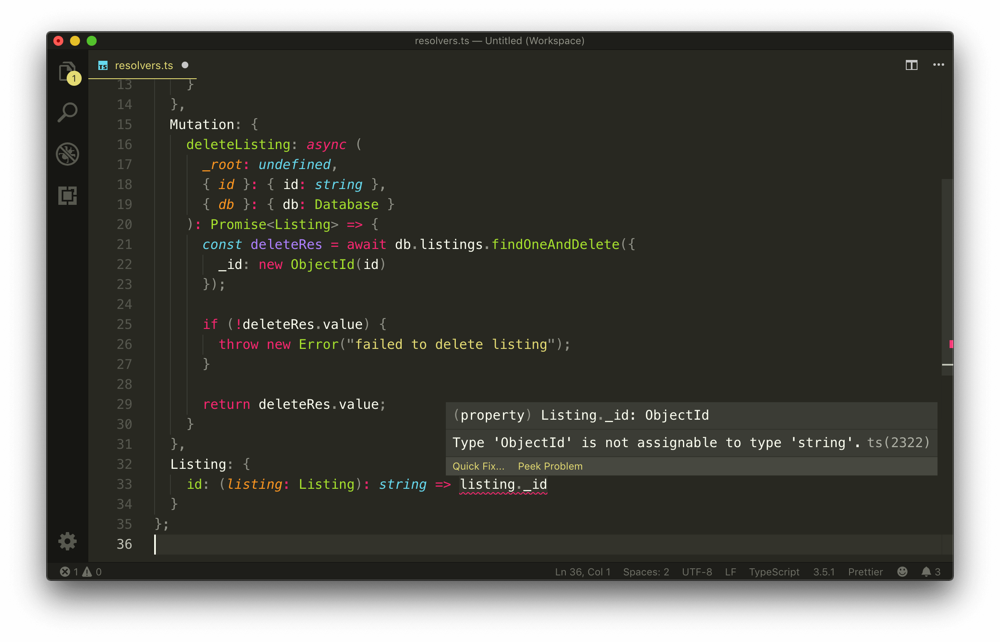

With all the changes made, our `src/graphql/resolvers.ts` file will now look like the following:

```typescript
import { ObjectId } from "mongodb";
import { IResolvers } from "apollo-server-express";
import { Database, Listing } from "../lib/types";

export const resolvers: IResolvers = {
  Query: {
    listings: async (
      _root: undefined,
      _args: {},
      { db }: { db: Database }
    ): Promise<Listing[]> => {
      return await db.listings.find({}).toArray();
    }
  },
  Mutation: {
    deleteListing: async (
      _root: undefined,
      { id }: { id: string },
      { db }: { db: Database }
    ): Promise<Listing> => {
      const deleteRes = await db.listings.findOneAndDelete({
        _id: new ObjectId(id)
      });

      if (!deleteRes.value) {
        throw new Error("failed to delete listing");
      }

      return deleteRes.value;
    }
  },
  Listing: {
    id: (listing: Listing): string => listing._id.toString()
  }
};
```

We'll start our server and verify that our `listings` query works as expected.

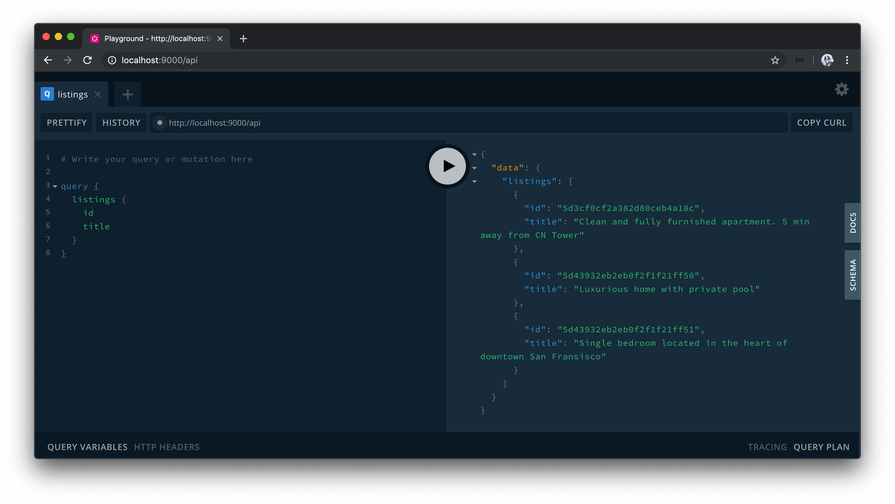

If we were to copy an `id` from one of the listing objects returned from our query and use it as the argument value for the `deleteListing` mutation, we'll observe that our `deleteListing` mutation also deletes a listing successfully.

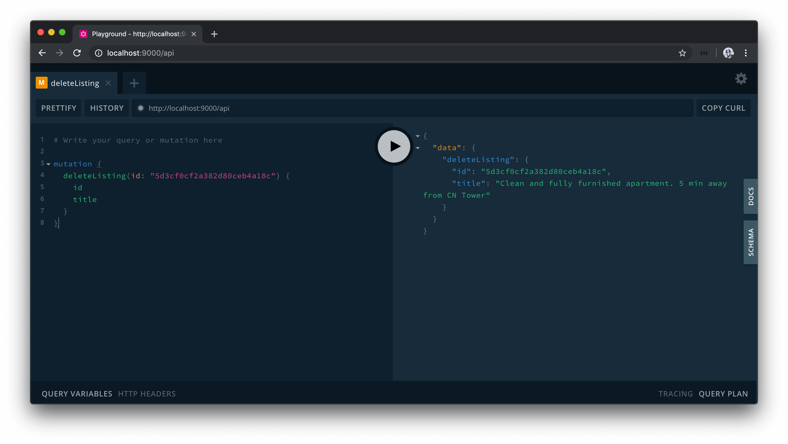

This asserts that we now have our GraphQL API interact and manipulate persisted data in a database.

> At any moment in time, you should be able to run the `seed` script to introduce more listings to the database collection.

## Modularizing Resolvers

> 对resolvers进行模块化拆分

If our app was to continue to grow, our `resolvers.ts` file will continue to get bigger to accommodate all the different resolvers within the different object types in our API. Though there's nothing inherently wrong with this, we can look to [separate our resolvers into different resolvers maps (i.e. modules)](https://www.apollographql.com/docs/apollo-server/essentials/data/#modularizing-resolvers) in such a way that each resolvers map will pertain a particular domain (or module).


For example, assume we had a resolvers map just for resolvers that pertain to the listings domain (i.e. the `listingResolvers`). The listings resolvers map will encompass all the resolvers that pertain to the listing domain or module such as the `listings` query, the `deleteListing` mutation, the `id` resolver field for the `Listing` object, etc.

```typescript
export const listingResolvers: IResolvers = {
  Query: {
    listings: () => {
      // ...
    }
  },
  Mutation: {
    deleteListing: () => {
      // ...
    }
  },
  Listing: {
    id: () => {
      // ...
    }
  }
};
```

We could have _another_ resolvers map that deals with a different domain or module. For example, we can have a `userResolvers` map that contained all the resolvers that pertain to retrieving or changing user data in our database.

```typescript
export const userResolvers: IResolvers = {
  Query: {
    users: () => {
      // ...
    }
  },
  Mutation: {
    deleteUser: () => {
      // ...
    }
  },
  User: {
    id: () => {
      // ...
    }
  }
};
```

This level of modularization will make no change to the actual functionality of our app but aim to have our resolvers be more concise and easier to read.

Let's set up the resolvers of our API to follow this level of modularization. The first thing we'll do is create a new folder called `resolvers` in our `src/graphql/` folder. The `src/graphql/resolvers/` folder is where we'll place each of our different resolvers objects.

```shell
server/
  src/
    graphql/
      resolvers/
      // ...
    // ...
```

In the `src/graphql/resolvers/` folder, we'll create a sub-folder for each module we'd want to have a resolvers object. At this moment in time, we only have the capability to modify and read data about listings (i.e. we only have a listings collection), so we'll create a `Listing/` sub-folder that contains an `index.ts` file where we'll create and export a `listingResolvers` map.

```shell
server/
  src/
    graphql/
      resolvers/
        Listing/
      // ...
    // ...
```

We'll move everything from our `src/graphql/resolvers.ts` file to the `index.ts` file in `src/graphql/resolvers/Listing/` and rename the exported `resolvers` object to `listingResolvers`.

```typescript
import { ObjectId } from "mongodb";
import { IResolvers } from "apollo-server-express";
import { Database, Listing } from "../../../lib/types";

export const listingResolvers: IResolvers = {
  Query: {
    listings: async (
      _root: undefined,
      _args: {},
      { db }: { db: Database }
    ): Promise<Listing[]> => {
      return await db.listings.find({}).toArray();
    }
  },
  Mutation: {
    deleteListing: async (
      _root: undefined,
      { id }: { id: string },
      { db }: { db: Database }
    ): Promise<Listing> => {
      const deleteRes = await db.listings.findOneAndDelete({
        _id: new ObjectId(id)
      });

      if (!deleteRes.value) {
        throw new Error("failed to delete listing");
      }

      return deleteRes.value;
    }
  },
  Listing: {
    id: (listing: Listing): string => listing._id.toString()
  }
};
```

We'll also remove the previously existing `src/graphql/resolvers.ts` file.

### `lodash.merge`

Since we only have a single resolvers map (`listingResolvers`), we could reference the `listingResolvers` map directly in our Apollo server instantiation. Instead, we'll look to prepare our app such that it is ready to accept and merge multiple different resolvers maps.

For us to pass multiple resolver objects into the `ApolloServer` constructor, we must find a way to merge them into a single object. Luckily, there is an npm package perfect for this and it comes from [lodash](https://lodash.com/).

> [Lodash](https://lodash.com/) is an incredibly useful utility library that provides a significant number of functions to help do a variety of different things needed to manipulate objects and arrays. We're most interested in the lodash [merge](https://lodash.com/docs/4.17.15#merge) method which helps recursively merge enumerable properties of source objects into a destination object.

We won't need the entire lodash library since we're only interested in the lodash `merge` method. As a result, we'll install the [`lodash.merge` package](https://www.npmjs.com/package/lodash.merge) which is a single `npm` package that provides the `merge` function alone.

In our terminal, we'll install the `lodash.merge` package as an application dependency.

```shell
server $: npm install lodash.merge
```

We'll also install the `@types/lodash.merge` package as a development dependency.

```shell
server $: npm install -D @types/lodash.merge
```

We'll create an `index.ts` file in our `src/graphql/resolvers/` folder and import the `merge` function from `lodash.merge`. We'll also import the `listingResolvers` map from the `src/graphql/resolvers/Listing` folder.

```typescript
import merge from "lodash.merge";
import { listingResolvers } from "./Listing";
```

We can then export a `const` variable labeled `resolvers` that uses the `merge` function and places the `listingResolvers` map within.

```typescript
import merge from "lodash.merge";
import { listingResolvers } from "./Listing";

export const resolvers = merge(listingResolvers);
```

If we were to now create different resolvers maps in our `src/graphql/resolvers` folder, we can import them in the `src/graphql/resolvers/index.ts` file and place them in the `merge` function to have them _merged_ into a single destination object.

```typescript
// example of having multiple resolvers objects
import merge from "lodash.merge";
import { bookingResolvers } from "./Booking";
import { listingResolvers } from "./Listing";
import { userResolvers } from "./User";

export const resolvers = merge(bookingResolvers, listingResolvers, userResolvers);
```

Our app is already prepared to consume the resolvers object. This is because the `src/index.ts` file imports the resolvers object from the `src/graphql/` folder.

```typescript
// ...
import { typeDefs, resolvers } from "./graphql";

const mount = async () => {
  // ...
};

// ...
```

And the `src/graphql/` folder exports the resolvers object from a resolvers file path in the `src/graphql/` folder.

**`src/graphql/index.ts`**

```typescript
export * from "./resolvers";
export * from "./typeDefs";
```

When we now run our app, everything should work as expected. Our `listings` query should retrieve all the listing documents in our listings collection.


And our `deleteListing` mutation will appropriately remove a listing document from our collection.


### `typeDefs`

Just like how a `resolvers` object can be broken down and modularized into smaller objects, the `typeDefs` string for our GraphQL schema could also be broken down to smaller sub-strings as well. This can be achieved with the use of the `extend` keyword, which allows for the creation of a schema by _extending_ a base schema. This can help avoid a large list of root `Query` and `Mutation` fields.

Here's [an example of a `typeDefs` schema from the Apollo Server documentation](https://www.apollographql.com/docs/graphql-tools/generate-schema/#extending-types) that shows the creation of two strings where the second type definitions string use the `extend` keyword to extend the root `Query` object type and introduce a `foos` field.

```graphql
const typeDefs = [`
  schema {
    query: Query
  }

  type Query {
    bars: [Bar]!
  }

  type Bar {
    id
  }
  `, `
  type Foo {
    id: String!
  }

  extend type Query {
    foos: [Foo]!
  }
`]
```

Though we're able to break our `typeDefs` schema to smaller pieces and subsequently into separate files, we personally prefer to have the entire `typeDefs` schema be kept in a single string within a single file. One reason we prefer to have all type definitions within a single string is that its hard for the `typeDefs` string to become large enough that it becomes to difficult to manage.

## Summary

In this module, we've established a connection between our Node server and the Mongo database with which we've created and set up in a database as a service known as MongoDB Atlas. Our database credentials are declared in a `.env` file to decouple environment-specific configuration and application code as well as to avoid committing our database configuration as part of our source code.

In the `temp/seed.ts` file, we've created a seed script that will help populate our database with three mock listings whenever the application `seed` script is run.

```typescript
require("dotenv").config();

import { ObjectId } from "mongodb";
import { connectDatabase } from "../src/database";
import { Listing } from "../src/lib/types";

const seed = async () => {
  try {
    console.log("[seed] : running...");

    const db = await connectDatabase();
    const listings: Listing[] = [
      {
        _id: new ObjectId(),
        title: "Clean and fully furnished apartment. 5 min away from CN Tower",
        image:
          "https://res.cloudinary.com/tiny-house/image/upload/v1560641352/mock/Toronto/toronto-listing-1_exv0tf.jpg",
        address: "3210 Scotchmere Dr W, Toronto, ON, CA",
        price: 10000,
        numOfGuests: 2,
        numOfBeds: 1,
        numOfBaths: 2,
        rating: 5
      },
      {
        _id: new ObjectId(),
        title: "Luxurious home with private pool",
        image:
          "https://res.cloudinary.com/tiny-house/image/upload/v1560645376/mock/Los%20Angeles/los-angeles-listing-1_aikhx7.jpg",
        address: "100 Hollywood Hills Dr, Los Angeles, California",
        price: 15000,
        numOfGuests: 2,
        numOfBeds: 1,
        numOfBaths: 1,
        rating: 4
      },
      {
        _id: new ObjectId(),
        title: "Single bedroom located in the heart of downtown San Fransisco",
        image:
          "https://res.cloudinary.com/tiny-house/image/upload/v1560646219/mock/San%20Fransisco/san-fransisco-listing-1_qzntl4.jpg",
        address: "200 Sunnyside Rd, San Fransisco, California",
        price: 25000,
        numOfGuests: 3,
        numOfBeds: 2,
        numOfBaths: 2,
        rating: 3
      }
    ];

    for (const listing of listings) {
      await db.listings.insertOne(listing);
    }

    console.log("[seed] : success");
  } catch {
    throw new Error("failed to seed database");
  }
};

seed();
```

In the `src/database/index.ts` file, we've created a `connectDatabase()` function that makes the connection between our Node server and the Mongo cluster in MongoDB Atlas. We've used the official [Node Mongo Driver](https://mongodb.github.io/node-mongodb-native/) to make our connection. Our `connectDatabase()` function returns an object of the collections we want our Node server to interact. As of this moment, we only have the single listings collection with which we've named as `test_listings` in our cluster.

```typescript
import { MongoClient } from "mongodb";
import { Database } from "../lib/types";

const url = `mongodb+srv://${process.env.DB_USER}:${process.env.DB_USER_PASSWORD}@${process.env.DB_CLUSTER}.mongodb.net`;

export const connectDatabase = async (): Promise<Database> => {
  const client = await MongoClient.connect(url, {
    useNewUrlParser: true,
    useUnifiedTopology: true
  });
  const db = client.db("main");

  return {
    listings: db.collection("test_listings")
  };
};
```

We've introduced TypeScript generics and with the capability of abstracting type information with the type definitions of the Node Mongo Driver, we've been able to define the type of data that can be returned from the listings collection.

```typescript
import { Collection, ObjectId } from "mongodb";

export interface Listing {
  _id: ObjectId;
  title: string;
  image: string;
  address: string;
  price: number;
  numOfGuests: number;
  numOfBeds: number;
  numOfBaths: number;
  rating: number;
}

export interface Database {
  listings: Collection<Listing>;
}
```

Our `listings` and `deleteListing` GraphQL resolvers interact with the MongoDB Database to either retrieve the list of listings in the listings collection OR delete a listing completely from the listings collection.

```typescript
import { ObjectId } from "mongodb";
import { IResolvers } from "apollo-server-express";
import { Database, Listing } from "../../../lib/types";

export const listingResolvers: IResolvers = {
  Query: {
    listings: async (
      _root: undefined,
      _args: {},
      { db }: { db: Database }
    ): Promise<Listing[]> => {
      return await db.listings.find({}).toArray();
    }
  },
  Mutation: {
    deleteListing: async (
      _root: undefined,
      { id }: { id: string },
      { db }: { db: Database }
    ): Promise<Listing> => {
      const deleteRes = await db.listings.findOneAndDelete({
        _id: new ObjectId(id)
      });

      if (!deleteRes.value) {
        throw new Error("failed to delete listing");
      }

      return deleteRes.value;
    }
  },
  Listing: {
    id: (listing: Listing): string => listing._id.toString()
  }
};
```

We've modularized our resolvers with the help of the [`lodash.merge` method](https://lodash.com/docs/4.17.15#merge) which helps us break our resolvers map function to specific modules.
